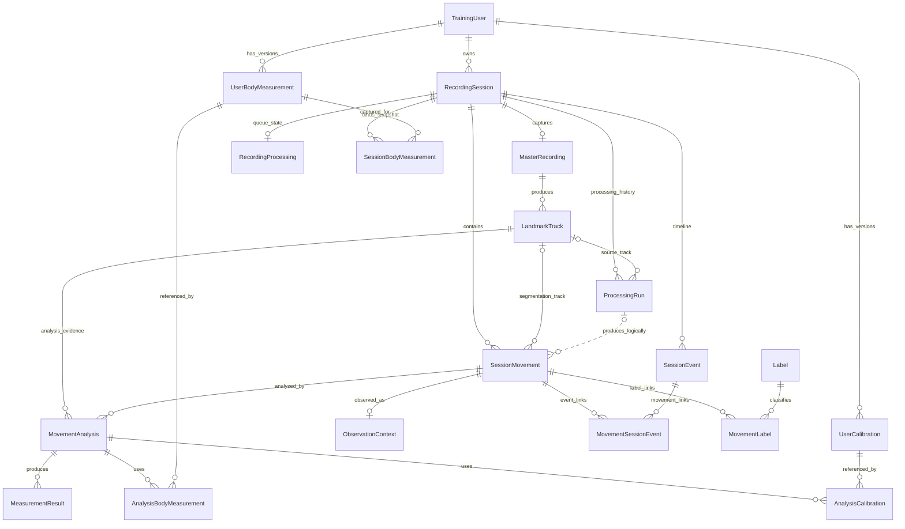

# Room database logical model — schema v10

Status: **OBSERVED** — code-derived logical model of the Android Room training/evidence database. Verified against source and the exported schema on **2026-09-23**.

This is the maintained data-model reference for this database. Update this document when persisted fields, relationships, or repository invariants change; link to it from other documents rather than maintaining another entity catalog or ER diagram.

Scope: current Android persistence. Platform responsibility and dependency decisions live in [Domain](../project-knowledge/DOMAIN.md) and [Architecture](../project-knowledge/ARCHITECTURE.md). This schema does not establish platform aggregate boundaries, remote storage, or synchronization design.

Source of truth used for this model:

- `training/KarateTrainingDatabase.kt` — entity registration, schema version and migrations
- `training/TrainingRows.kt` — Room entities, primary keys, foreign keys and indexes
- `training/TrainingModels.kt` — persisted domain fields and enums
- `training/TrainingDao.kt` — query paths and application-level relationship usage
- `training/TrainingRepository.kt` — transactions, validation, and publication behavior
- exported `app/schemas/dk.lasse.karatecliprecorder.training.KarateTrainingDatabase/10.json` — column nullability and physical constraints

This document describes the current logical structure. It intentionally distinguishes:

1. **Room-enforced relationships** — declared as foreign keys or uniqueness constraints.
2. **Application-level logical relationships** — IDs are used as references by repository/DAO code but Room does not currently enforce them as foreign keys.

The database is `karate-training.db`, currently **schema version 10**, with **19 Room entities**.

Media-relative times (`startUs`, `endUs`, playback bounds, `analysisFrameUs`, and `occurrenceUs`) are integer microseconds relative to recording start. Wall-clock fields such as `createdAtMs` are epoch milliseconds; duration fields ending in `Ms` are elapsed milliseconds.

Media and dense landmark samples remain files referenced by database rows. A retained master row does not imply its media file is still available; inspect `sourceState` and file availability.

---

## 1. High-level persistence model

The model has five main areas:

1. **Identity and capture**
   - user
   - recording session
   - master media
   - landmark evidence

2. **Processing lineage**
   - durable processing queue state
   - processing/reanalysis run history
   - current-run selection

3. **Movement evidence**
   - segmented movement intervals
   - observation/orientation context
   - session events
   - labels

4. **Analysis evidence**
   - analyzer executions
   - measurement results
   - exact landmark-track provenance

5. **Physical reference snapshots**
   - append-only user body measurements
   - append-only calibrations
   - exact references bound to sessions and analyses

The main persisted evidence chain is:

```text
TrainingUser
  -> RecordingSession
      -> MasterRecording
          -> LandmarkTrack
      -> ProcessingRun
          -> SessionMovement
              -> MovementAnalysis
                  -> MeasurementResult
```

The real model is richer because events, labels, body measurements and calibrations attach alongside that main chain.

---

## 2. Logical ER model



> Cardinalities show database-permitted relationships; the dotted run-to-movement edge is a logical reference only. Repository operations may impose stronger requirements.
>
> The `ProcessingRun -> SessionMovement` edge is logically used through `SessionMovement.runId`, but it is **not currently declared as a Room foreign key**.
>
> `RecordingProcessing.sourceLandmarkTrackId` is also a logical provenance reference without a declared Room foreign key.

---

## 3. Entity catalog

### TrainingUser

**Primary key:** `userId`

Purpose: durable identity used by the training/evidence database.

Key fields:

- `userId`
- `createdAtMs`

Relationships:

- 1 -> many `RecordingSession`
- 1 -> many `UserBodyMeasurement`
- 1 -> many `UserCalibration`

Deletion is restricted while dependent recording/reference rows exist.

---

### RecordingSession

**Primary key:** `sessionId`

**Foreign key:** `userId -> TrainingUser.userId`

Purpose: top-level capture/training event.

Important fields include:

- timing: `startedAtMs`, `endedAtMs`
- activity context: `activityKey`, `expectedActivity`, `expectedCategory`
- requested plan context: `expectedRepetitions`, `requestedView`
- capture/cue context: `captureTrigger`, `cueMode`, `audioCuePackageVersionId`
- lifecycle: `state`, `reason`, `interruptionReason`, `captureOutcome`
- external/request lineage: `callerId`, `parentId`

Index:

- `(userId, startedAtMs)`

Logical role: central persistence grouping for a capture session. This does not establish a domain aggregate boundary.

---

### RecordingProcessing

**Primary key:** `sessionId`

**Foreign key:** `sessionId -> RecordingSession.sessionId` with cascade delete.

Purpose: durable queue/current processing status for the session.

Important fields:

- `queuedAtMs`
- `promotedAtMs`
- `state`
- `phase`
- `manual`
- `planKey`, `planVersion`
- `sourceLandmarkTrackId`
- `segmentationVersion`
- phase durations
- `error`

Index: `(state, queuedAtMs)`.

This is **not processing history**. It is the durable queue/status row for the recording.

Logical-only reference:

- `sourceLandmarkTrackId -> LandmarkTrack.landmarkTrackId`

Room does not currently declare that foreign key.

---

### MasterRecording

**Primary key:** `recordingId`

**Foreign key:** `sessionId -> RecordingSession.sessionId` with cascade delete.

**Unique index:** `sessionId`

Purpose: authoritative captured media attached to the session.

The unique session index enforces **at most one master recording per recording session**. `TrainingRepository.beginSession` inserts the session and its master recording together in one transaction, giving that creation path exactly one master row.

Important fields:

- `filePath`
- media timing/dimensions: `durationUs`, `frameRate`, `width`, `height`
- device/camera provenance
- `captureType`, `mimeType`
- `sourceState`
- `rotation`
- `canonicalGeometryJson`

---

### LandmarkTrack

**Primary key:** `landmarkTrackId`

**Foreign key:** `recordingId -> MasterRecording.recordingId` with cascade delete.

Purpose: versioned pose/landmark evidence derived from one master recording.

Important fields:

- pipeline identity: `pipelineKey`, `pipelineVersion`, `configuration`
- `filePath`
- `state`, `sourceState`
- quality/hash information
- `formatId`, `formatVersion`
- `canonicalGeometryJson`

A recording may have multiple landmark tracks, supporting reprocessing and model/pipeline upgrades.

---

### ProcessingRun

**Primary key:** `runId`

**Foreign keys:**

- `sessionId -> RecordingSession.sessionId` with cascade delete
- `sourceLandmarkTrackId -> LandmarkTrack.landmarkTrackId` with `SET_NULL`

Purpose: retained processing/reanalysis lineage for a session. Runs are mutable lifecycle records: `updateRun`, `publishRun`, and `failRun` update their state, timing, and/or current selection.

Important fields:

- `mode`: initial, reanalysis or landmark reprocess
- `planKey`, `planVersion`
- source landmark track
- segmenter/analyzer versions
- state and timing
- `isCurrent`
- errors

Indexes:

- `(sessionId, createdAtMs)`
- `(sessionId, isCurrent)`
- `sourceLandmarkTrackId`

Important invariant:

- `TrainingRepository.publishRun` clears previous current flags and publishes the selected run transactionally.
- a session can have no current run; generic `createRun`/`updateRun` do not independently enforce current-run uniqueness.
- Room does **not** enforce “maximum one current run per session” with a unique constraint.

---

### SessionMovement

**Primary key:** `movementId`

**Foreign keys:**

- `sessionId -> RecordingSession.sessionId` with cascade delete
- `segmentationTrackId -> LandmarkTrack.landmarkTrackId` with deferred `NO_ACTION`

Purpose: detected movement interval within a recording session.

Important fields:

- logical bounds: `startUs`, `endUs`
- retained playback bounds: `playbackStartUs`, `playbackEndUs`
- `state`
- segmenter source/version/confidence
- `segmentationTrackId`
- `runId`
- `analysisFrameUs`

Indexes include:

- `(sessionId, startUs)`
- `segmentationTrackId`
- unique `(movementId, sessionId)`
- `runId`

Important logical-only relationship:

- `runId -> ProcessingRun.runId`

The DAO uses `runId` to retrieve movements for a processing run, but Room does not currently define a foreign key for it.

---

### ObservationContext

**Primary key:** `movementId`

**Foreign key:** `movementId -> SessionMovement.movementId` with cascade delete.

Purpose: persisted observation geometry/context for one movement.

Important fields:

- `view`
- `nearerSide`
- `bodyToCameraDegrees`
- `confidence`
- `evidence`

Because `movementId` is both PK and FK, this is a **0..1 to 1 extension row** for a movement.

---

### SessionEvent

**Primary key:** `sessionEventId`

**Foreign key:** `sessionId -> RecordingSession.sessionId` with cascade delete.

Purpose: timestamped session-level events on the recording timeline.

Important fields:

- `type`
- `timestampUs`
- `data`
- `timingSource`

Index:

- `(sessionId, timestampUs)`
- unique `(sessionEventId, sessionId)`, supporting the composite event-link foreign key

---

### MovementSessionEvent

**Composite primary key:** `(movementId, sessionEventId)`

Purpose: many-to-many association between movement intervals and session events.

It carries `sessionId` so composite foreign keys can enforce that both linked rows belong to the same session.

Composite foreign keys:

- `(movementId, sessionId) -> SessionMovement(movementId, sessionId)`
- `(sessionEventId, sessionId) -> SessionEvent(sessionEventId, sessionId)`

This is a strong ownership-integrity design: an event from one recording session cannot be attached to a movement in another.

---

### Label

**Primary key:** `labelId`

**Unique index:** `machineKey`

Purpose: reusable classification/context vocabulary.

Important fields:

- `machineKey`
- `displayText`
- `category`

Labels are not owned by movements and survive movement deletion.

---

### MovementLabel

**Composite primary key:** `(movementId, labelId)`

Foreign keys:

- movement -> `SessionMovement` with cascade delete
- label -> `Label` with restrict delete

Purpose: many-to-many classification of movement evidence.

Additional field:

- `source`

The source field keeps the distinction between contextual labeling and independently inferred technique classification.

---

### MovementAnalysis

**Primary key:** `analysisId`

Foreign keys:

- `movementId -> SessionMovement.movementId` with cascade delete
- `landmarkTrackId -> LandmarkTrack.landmarkTrackId` with deferred `NO_ACTION`

Purpose: one analyzer execution/version against one movement using exact landmark evidence.

Important fields:

- `analyzerKey`
- `analyzerVersion`
- `landmarkTrackId`
- `state`
- `createdAtMs`
- `reason`
- `geometryJson`

Multiple analyses may exist for the same movement. History is retained rather than overwritten.

---

### MeasurementResult

**Primary key:** `measurementResultId`

**Foreign key:** `analysisId -> MovementAnalysis.analysisId` with cascade delete.

Purpose: individual output from a movement analysis.

Important fields:

- `measurementKey`
- `calculationVersion`
- numeric or categorical value
- `side`
- `role`
- `state`
- confidence/uncertainty
- occurrence time/frame
- abstention/failure reason

Indexes:

- `analysisId`
- `measurementKey`

This is the historical metric/evidence layer used by history queries.

---

### UserBodyMeasurement

**Primary key:** `bodyMeasurementId`

**Foreign key:** `userId -> TrainingUser.userId` with restrict delete.

Purpose: append-only versioned physical measurements for a user.

Important fields:

- `type`
- `value`
- `canonicalUnit`
- `measuredAtMs`
- `source`

Index:

- `(userId, type, measuredAtMs)`

---

### UserCalibration

**Primary key:** `calibrationId`

**Foreign key:** `userId -> TrainingUser.userId` with restrict delete.

Purpose: append-only versioned calibration evidence.

Important fields:

- `type`
- `measuredAtMs`
- `version`
- `source`
- `state`
- `data`

Index:

- `(userId, type, measuredAtMs)`

---

### AnalysisBodyMeasurement

**Composite primary key:** `(analysisId, bodyMeasurementId)`

Foreign keys:

- analysis -> `MovementAnalysis` with cascade delete
- body measurement -> `UserBodyMeasurement` with restrict delete

Purpose: binds an analysis to the exact physical measurement version(s) used.

This prevents later profile edits from silently reinterpreting historical analysis.

---

### AnalysisCalibration

**Composite primary key:** `(analysisId, calibrationId)`

Foreign keys:

- analysis -> `MovementAnalysis` with cascade delete
- calibration -> `UserCalibration` with restrict delete

Purpose: binds an analysis to the exact calibration version(s) used.

---

### SessionBodyMeasurement

**Composite primary key:** `(sessionId, bodyMeasurementId)`

Foreign keys:

- session -> `RecordingSession` with cascade delete
- body measurement -> `UserBodyMeasurement` with restrict delete

Purpose: records which physical measurement versions were captured/bound to the recording session.

---

## 4. Main lifecycle view

### Capture

```text
TrainingUser
  -> RecordingSession
      -> MasterRecording
```

`beginSession` creates the session and master recording atomically. The database alone permits a session with no master recording.

### Landmark extraction

```text
MasterRecording
  -> LandmarkTrack v1
  -> LandmarkTrack v2
  -> ...
```

Landmark evidence is versioned and can coexist.

### Processing / reprocessing

```text
RecordingSession
  -> RecordingProcessing       current queue/status
  -> ProcessingRun A           historical run
  -> ProcessingRun B           historical run, possibly current
```

`RecordingProcessing` and `ProcessingRun` therefore solve different problems:

- `RecordingProcessing` = durable operational queue state.
- `ProcessingRun` = durable processing lineage/history.

### Segmentation

```text
ProcessingRun
  -> SessionMovement*
```

This relationship currently exists at the application level through `SessionMovement.runId`.

Each movement also identifies the exact landmark track used for segmentation through `segmentationTrackId`.

Both `runId` and `segmentationTrackId` are nullable, so this lineage is not present on every movement row. `saveSegmentation` checks track ownership when a track is supplied, but does not validate that `runId` exists or belongs to the movement's session.

### Analysis

```text
SessionMovement
  -> MovementAnalysis*
      -> MeasurementResult*
```

Each analysis stores the exact analyzer version and landmark track used.

Body measurement and calibration join rows bind exact physical-reference versions to the analysis.

---

## 5. Important logical invariants

### At most one master recording per session

Enforced by the unique `MasterRecording(sessionId)` index. Exactly one is supplied by the repository's `beginSession` transaction.

### Zero or one durable queue row per session

Enforced because `RecordingProcessing.sessionId` is both PK and FK.

### Multiple processing runs per session

Explicitly supported.

### Current processing run selection

Implemented transactionally in repository code using:

1. clear current flags for the session
2. set the selected run to `isCurrent = true`

This is **not enforced by a unique database constraint**. A session can have zero current runs. The guarantee applies to `publishRun`; generic `createRun` and `updateRun` accept the supplied `isCurrent` value.

### Movement ownership

A movement belongs to exactly one recording session.

### Movement -> processing run lineage

Used by the application through `SessionMovement.runId`, but **not FK-enforced**.

### Exact evidence provenance

Analyses retain exact:

- movement ID
- analyzer key/version
- landmark track
- physical measurement IDs
- calibration IDs

These references support traceability and reanalysis when the referenced evidence remains available. Body/calibration joins are optional; `saveAnalysis` defaults both ID lists to empty. IDs and versions alone do not guarantee that source files or every execution input are retained.

### Append-only user physical references

Body measurements and calibrations are inserted as new rows through `addBodyMeasurement` and `addCalibration`; the DAO exposes no update operation for them. This is repository/API behavior, not a database immutability constraint.

### Cross-session event protection

The composite FKs in `MovementSessionEvent` enforce that a movement and event association cannot cross session boundaries.

---

## 6. Room-enforced vs application-enforced references

This table highlights direct references; the entity catalog above also covers the join-table foreign keys. A foreign key to a track or physical reference establishes existence, but does not by itself establish matching session/user ownership. `saveAnalysis` checks the track's session and the owner of supplied body/calibration IDs; `beginSession` checks the owner of supplied body IDs.

| Reference | Logical meaning | Room FK? | Notes |
|---|---|---:|---|
| `RecordingSession.userId` | session owner | Yes | RESTRICT on user deletion |
| `MasterRecording.sessionId` | session media | Yes | unique session index |
| `LandmarkTrack.recordingId` | track source media | Yes | cascade |
| `RecordingProcessing.sessionId` | queue state for session | Yes | one row max |
| `RecordingProcessing.sourceLandmarkTrackId` | queue provenance | **No** | application-level only |
| `ProcessingRun.sessionId` | run owner | Yes | cascade |
| `ProcessingRun.sourceLandmarkTrackId` | run source track | Yes | SET_NULL |
| `SessionMovement.sessionId` | movement owner | Yes | cascade |
| `SessionMovement.segmentationTrackId` | segmentation evidence | Yes | deferred NO_ACTION |
| `SessionMovement.runId` | producing processing run | **No** | indexed/queryable logical reference |
| `MovementAnalysis.movementId` | analyzed movement | Yes | cascade |
| `MovementAnalysis.landmarkTrackId` | analysis evidence | Yes | deferred NO_ACTION |
| `RecordingSession.parentId` | request/session lineage | **No** | opaque logical ID |
| `RecordingSession.callerId` | caller provenance | **No** | opaque logical ID |

---

## 7. Architectural reading

The schema is fundamentally an **evidence/history model**, not a “latest calculated value” database.

The strongest part of the design is the separation between:

- captured media,
- derived landmark evidence,
- processing-run lineage,
- segmented movements,
- analyzer executions,
- individual measurements,
- physical-reference versions.

That means reprocessing can create new evidence without erasing the evidence used by earlier results.

`RecordingSession` is the central persistence grouping, while `ProcessingRun` provides a second axis for derivation history. Neither the foreign-key graph nor this document establishes a platform aggregate boundary.

A useful evidence relationship view is (these arrows are not code dependency directions):

```text
TrainingUser
  -> RecordingSession
      -> MasterRecording
          -> LandmarkTrack
      -> ProcessingRun
          -> SessionMovement
              -> ObservationContext
              -> labels/events
              -> MovementAnalysis
                  -> MeasurementResult
                  -> exact body/calibration references
```

---

## 8. Model observations worth keeping visible

1. **`SessionMovement.runId` is not FK-enforced.**  
   This is currently the biggest difference between the logical model and the physical Room constraint graph.

2. **`RecordingProcessing.sourceLandmarkTrackId` is not FK-enforced.**  
   It behaves as provenance metadata rather than a constrained relationship.

3. **“One current run” is an application invariant.**  
   `publishRun` establishes the selection transactionally. The `(sessionId, isCurrent)` index is not unique, and generic run writes do not enforce it.

4. **Analysis provenance is strong.**  
   Each analysis references an exact movement, analyzer version and landmark track, with versioned body/calibration references.

5. **Processing queue state and processing history are correctly separate concepts.**  
   `RecordingProcessing` should not be merged conceptually with `ProcessingRun`.

6. **Current-run movement selection and measurement history use different query paths.**  
   `TrainingRepository.movements` and `movementCount` default to the current run, falling back to all session movements when none is current. `TrainingDao.historyCandidates` does not filter by current run; `history` selects preferred analysis per movement ID. Do not assume that history excludes movements from older processing runs or deduplicates repetitions across runs.


---

## 9. Source files

Current implementation paths:

```text
android/KarateClipRecorder/app/src/main/java/dk/lasse/karatecliprecorder/training/
  KarateTrainingDatabase.kt
  TrainingRows.kt
  TrainingModels.kt
  TrainingDao.kt
  TrainingRepository.kt
```

[Database and migrations](../android/KarateClipRecorder/app/src/main/java/dk/lasse/karatecliprecorder/training/KarateTrainingDatabase.kt) · [Room entities](../android/KarateClipRecorder/app/src/main/java/dk/lasse/karatecliprecorder/training/TrainingRows.kt) · [Persisted fields](../android/KarateClipRecorder/app/src/main/java/dk/lasse/karatecliprecorder/training/TrainingModels.kt) · [DAO](../android/KarateClipRecorder/app/src/main/java/dk/lasse/karatecliprecorder/training/TrainingDao.kt) · [Repository](../android/KarateClipRecorder/app/src/main/java/dk/lasse/karatecliprecorder/training/TrainingRepository.kt) · [Exported schema v10](../android/KarateClipRecorder/app/schemas/dk.lasse.karatecliprecorder.training.KarateTrainingDatabase/10.json)

## 10. Maintaining this model

When changing persistence:

1. Update this document in the same change as the affected entities, fields, queries, or repository behavior.
2. Check database cardinality and nullability against the exported schema; distinguish foreign keys and indexes from application checks.
3. Update the diagram, relevant entity entry, and invariant descriptions together. Describe repository guarantees by the operation that enforces them.
4. For schema changes, increment the Room version, add and register explicit migrations, and retain earlier exported schemas. Run the relevant `TrainingSchemaTest` and `TrainingMigrationTest` checks.
5. Update the schema version and verification date above. Keep the navigation entry in [Project Structure](../project-knowledge/PROJECT_STRUCTURE.md) pointing here.

This document summarizes key fields. The linked Kotlin models and exported schema specify the complete field types, defaults, and nullability. Operational notes and historical validation remain in [Android training evidence database](app-training-database.md).
