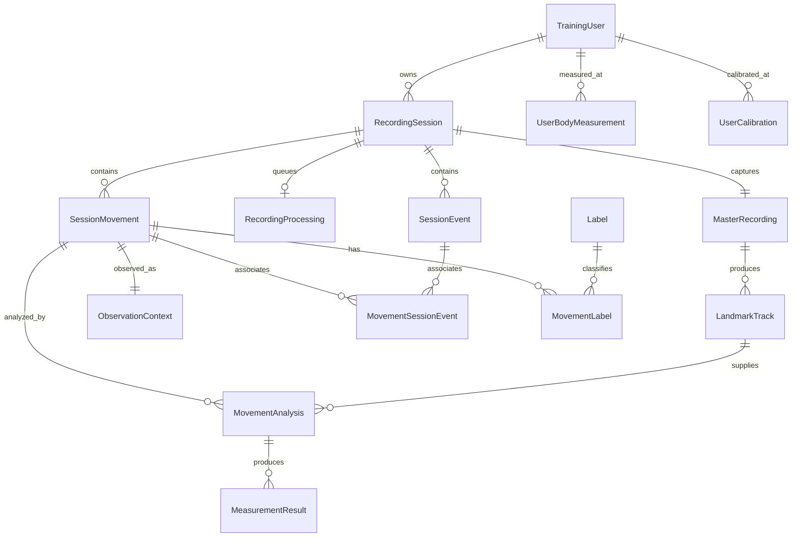

# Android training evidence database

Status: implemented in local source; physical-device acceptance is pending. See the
[implementation backlog](backlog/karate-training-database.md) for the remaining checks.

## Storage boundary

`training/KarateTrainingDatabase` is the authoritative structured store for new
CameraX recording sessions. Its file is `karate-training.db`, Room schema version
**6**. Exported schemas v1–v6 are retained under `app/schemas/`.
The explicit v1→v2 migration adds nullable session cadence/counting/delay
snapshots and landmark format ID/version; existing evidence is preserved.
The v2→v3 migration adds expected activity/category and interruption reason;
v3→v4 adds the durable processing queue and backfills saved assisted recordings.
The v4→v5 migration adds shared capture request/result fields and media type, so
video and photo evidence use the same durable identity model. The v5→v6 migration
adds the recording processing-plan snapshot, current phase, landmark/segmentation
durations, and source landmark/segmenter provenance.

The existing project uses Kotlin 2.0.21, AGP 8.7.3, Java 17, minSdk 26 and native
Android Views (no Compose dependency). Room 2.7.2 with KSP 2.0.21-1.0.28 fits that
toolchain without a Kotlin/AGP upgrade. Room 2.7 requires Kotlin 2.0 or newer;
see the [official release notes](https://developer.android.com/jetpack/androidx/releases/room#2.7.2).

Production never enables main-thread queries or destructive migration fallback.
Future schema changes must increment the database version, retain all older
exported schemas, supply explicit migrations in the production builder, and extend
`TrainingMigrationTest` and `TrainingSchemaTest`. Version 1 has a schema/opening
baseline, not an invented migration from a nonexistent Room version 0.
The baseline test must actually reopen a database created from the exported
schema: a stale incremental schema export was caught this way during authoring.
Rerun `:app:kspDebugKotlin --rerun` when validating an export. Never replace a
previously shipped schema to conceal a version change.

`AnalysisBodyMeasurement`, `AnalysisCalibration`, and `SessionBodyMeasurement`
retain exact physical-reference IDs. These are relationships, not mutable current
calibration pointers. No derived movement counts, sequence numbers, rolling
history buckets, coverage cache, measurement-definition table, or dense
per-frame landmark rows are stored.

Room entities and DAO are internal. `TrainingRepository` accepts/returns domain
models and owns transactions, ownership checks and history selection.
`TrainingServices` supplies a light storage executor and a separate heavy executor.
Room queue rows and WorkManager drive durable, serial MLS jobs; capture has priority.
UI and
analyzers do not call DAOs.

## Files, timing and provenance

MP4s remain files. Their UUID filenames are never reused, including after video
deletion. A master recording can outlive its MP4. Actual duration/resolution and
frame rate, when reported by the media source, are stored; a preferred camera FPS
is not passed off as measured FPS.

New dense landmarks use Movement Landmark Stream v1 (`.mls`) under
`files/training/landmarks/<landmarkTrackUuid>.mls`. The explicit new header is
`movement_landmark_stream_v1`; a separate legacy reader supports old
`karate_pose_track_v1` payloads. This is a header transition, not a byte alias.
The [format contract](movement-landmark-stream-format.md) specifies both layouts.
Normalized image and world coordinates, visibility, presence, source and times
are retained. `.mls.tmp` is flushed/synced, validated and hashed before rename
and Room completion. Tracks record model-asset hash, MediaPipe/decoder versions,
VIDEO/CPU mode and confidence configuration. Multiple tracks remain supported.

Assisted MP4s use `files/training/recordings/<recordingUuid>.mp4`; shared photos
use `files/training/photos/<captureUuid>.jpg`. Room references
are relative to `files/training`; the storage resolver also accepts explicit
legacy absolute references. Legacy guided MP4 exports keep their existing path.

All persisted media-relative timestamps are integer **microseconds relative to
recording start**, including result occurrence times. To obtain an occurrence
relative to the movement, subtract `movement.startUs`. Wall-clock dates end in
`AtMs` and are epoch milliseconds. The current pose decoder resolves source PTS to
milliseconds; converting to microseconds does not increase that resolution.

Guided cues use CameraX Start plus elapsed-real-time timing. A cue issued before
video start is clamped to zero with explicit `before_video_start_clamped`
provenance. These are prompt-emission times, not verified audio-onset times.

Observation context uses each movement's observed world shoulders and available
nose evidence. It records an approximate acute camera angle, nearer side and
front/side/other/unknown classification. Confidence is landmark evidence, not a
calibrated orientation probability. Significant within-movement angle change is
marked `OTHER`. Missing evidence stays unknown; requested setup never becomes
observed geometry. The estimate does not make any measurement valid.

## Pipeline and result policy

CameraX waits for the user/session/master rows and captured physical references
to be saved before starting a capture. Finalization validates the media, commits
dimensions/duration and capture outcome, then publishes a semantic durable-media
event before delivering the saved callback. Stop during pending preparation cancels
the eventual hardware start. Activity backgrounding stops recording/countdown;
late guided processing callbacks cannot complete a cancelled or newer attempt.

Guided and general recordings use `TrainingSessionProcessor`. It retains the
landmark file, saves the segmentation set and observation/label/cue relationships
transactionally, then saves each analysis and its results atomically. On resume,
existing movement IDs and their segmentation track are reused. Display ordering
is queried by start/end timestamp, with ID as a deterministic tie breaker.
`addMovement` can insert a missed repetition without renumbering historical rows.

The processing subsystem discovers eligible finalized videos from Room after the
recorder publishes its event; capture and persistence do not insert or understand
queue jobs. The new Skill Coach [assisted capture page](record-and-analyze-assisted-capture-v1.md)
therefore returns saved success before background processing starts. One durable
recording job now advances through landmark extraction and retrospective
segmentation. Its persisted plan snapshot is `straight_punch_segments` v1:
landmarks and segmentation are required and no analyzers are configured. The job
becomes Ready only after segmentation, including a valid zero-movement result.

The segmenter reads the completed `.mls` track; it does not run MediaPipe a second
time. Segments reference that track and persist distinct logical and buffered
playback intervals. Saving is transactional and retries reuse the existing
movement identities, so planned repetition count never trims or creates movement
rows. Only `spoken_count` and the legacy `cue` event type enter cue association;
Stop, interruption, capture-outcome, and other lifecycle events do not.

The job persists its phase (`LANDMARKS`, `SEGMENTATION`, optional future
`ANALYSIS`, or terminal `READY`/`FAILED`), both phase durations, selected plan
version, source track, and segmenter version. QTray reads those phases and never
runs work. Performance Recordings shows planned and detected counts separately,
processing/failure state, and a durable Segments section with logical/playback
bounds and interval playback. MLS or segmentation failure preserves the successful
MP4 and any valid upstream landmark evidence and offers retry.

Guided Straight Punch and Jōdan labels have `activity_context` assignment source;
they express the drill context, not independently recognized technique/target.
Free recordings do not receive those labels automatically.

The dynamic wrist-path/speed analyzers in this repository are **Python**, not
Android components. This foundation does not port or change those calculations.
The Android adapter invokes the existing `PunchHeightAnalyzer` and persists:

- `PUNCH_HEIGHT_ERROR_TORSO_RATIO`, in torso ratios;
- `PUNCH_ELBOW_ANGLE`, in degrees.

Its static setup may be unsuitable for a dynamic recording. Any returned values
are explicitly **partial**, with `dynamic_validation_pending` evidence. Missing
setup/landmarks or unidentified technique produces **abstained** result rows.
No physical centimetres, wrist straightness, or valid karate assessment are
fabricated. Default history excludes these provisional results.

`TrainingMeasurements` contains stable code definitions: meaning, unit, role,
technique, view/orientation requirements, landmarks, phase and calculation
version. New calculators must add their own definitions and approved analyzer
versions. Existing ratios must never be relabelled as physical distances.

`preferredAnalysis` uses an explicit newest-first approved version list, then the
newest completed/partial run in that version; failed/abstained or unapproved runs
cannot displace it. `history` applies current labels, side/role, quality and
confidence policy before taking its limit. It selects only the preferred run
for a movement, preserving all older runs in storage. One movement can contribute
to several label-based histories without being copied. Within a requested series,
each side/role has one result per preferred analysis.

Processing completion is distinct from valid measurement evidence. The UI's
`N movements found` comes from `COUNT(*)` on related movement rows, including when
N differs from the expected ten. No count is forced to fit the drill plan.

## Existing profile data and JSON compatibility

`trainee_profiles.db` continues to own existing profile display/preferences and
learning progress. Its UUIDs are reused by `TrainingUser`; no duplicate trainee
is created for each recording. Existing body dimensions and calibration payloads
are archived into the new append-only reference tables, and subsequent profile
edits append changed physical values. Recording snapshots bind exact reference
IDs at capture time. The legacy profile fields remain a compatibility/presentation
copy; they are not the source used to reinterpret historical analysis.

Legacy JSON captures/learning-attempt payloads are not bulk-imported as inferred
movements. Production guided processing no longer writes session metadata JSON.
The recording body-measurement sidecar remains a compatibility **export** for
desktop analyzers. Its failure does not invalidate the authoritative Room save.
JSON remains supported for test fixtures/import. Existing learning-attempt rows
can reference `training-session:<UUID>` instead of duplicating this evidence.

## Deletion and interrupted work

- `deleteVideo` persists DELETING before removing the MP4, then DELETED. Landmarks,
  movements, analyses and values remain. The existing clear-history action now
  also removes selected-profile Room videos while retaining measured evidence;
  its legacy session-entry/photo cleanup remains.
- Explicit `deleteSession` removes its owned database graph in one transaction.
  It does not pretend filesystem removal is transactional; delete files through
  their explicit lifecycle before removing the owning database references.
- Labels survive movement deletion. User deletion is restricted when sessions or
  reference measurements/calibrations exist. Deleting a legacy display profile
  does not implicitly cascade through the training evidence database.
- Startup reconciles interrupted video deletion and missing files, marks
  interrupted processing partial, and checks pending videos for valid finalized
  media metadata. No camera or MediaPipe starts at application startup.
- A track published immediately before process loss can be checked and completed
  on retry. Existing segmentation and successful analyses are reused. Corrupt
  or missing landmark files leave an explicit partial state; history stays intact.

Recovery is exposed through repository/session-processor APIs and the existing
WorkManager recording queue. Segmentation remains an internal phase of the same
serial heavy-processing job rather than a second queue.

## Verification

See the [2026-09-14 validation record](validation/training-database-v1.md) for
commands, test counts, baseline failures and device limitations.

Tests cover the evidence graph, chronological insertion, multiple tracks, several
cues per movement, labels, reanalysis approval/fallback, source deletion,
append-only physical references, atomic rollback, foreign keys, cross-session
ownership, restart/reopen, landmark round-trip/checksum, non-destructive version
failure, exported schema and rolling queries over 120 synthetic movements.

The deterministic continuous synthetic recording must produce exactly ten
movements through the existing segmenter. An optional local real-recording pose
fixture exercises the same persistence path and preserves additional detected
post-drill reset movements rather than forcing ten.
The current local fixture produced **13** movements (ten punches plus additional
detected movement), while the deterministic synthetic fixture produced exactly
**10**. Both retained their movement identities and measurements after reopening
the database and deleting only the MP4; neither required a second landmark decode.

SQLite's inspected rolling-history plan uses the measurement-key index, primary
key indexes for the analysis/movement/session joins, and a temporary B-tree for
chronological ordering. The session-movement ordered query uses its composite
index. No speculative history cache/index was added to hide that sort.

The migration baseline runs with Robolectric and is also provided as an Android
instrumentation test. Native CameraX, MediaPipe extraction, a fresh physical
ten-punch recording, device process-kill recovery and live UI verification require
a connected device. No deployment is claimed.
