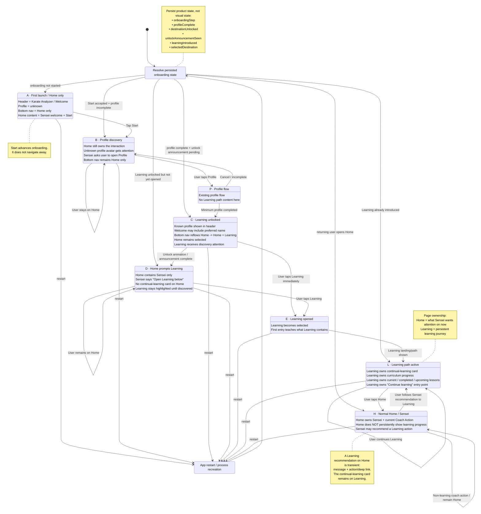

# Home vs Learning — ownership update for onboarding v0.2

Status: OPEN

## Purpose

This document is a **separate follow-up** to the Chrome requirements already handed to VS Code.

It does **not** replace or modify the Chrome foundation specification.

Its purpose is to clarify a product decision made after that document was written:

> The persistent **Continual Learning / Continue Learning** card belongs on the **Learning page**, not on the Home page with the Sensei.

The Home page may still recommend the same learning content, but Home should not permanently duplicate the Learning page's progression UI.

---

# 1. Updated page ownership

The app should have a clear separation between the responsibilities of Home and Learning.

## Home / Sensei

Home answers:

> **What does Sensei want my attention on now?**

Home owns:

- Sensei artwork
- dojo/background environment
- Sensei speech bubble / coach message
- one current Coach Action
- onboarding guidance
- temporary observations
- temporary questions
- temporary recommendations
- temporary unlock introductions
- links/actions into other app areas when relevant

Home should remain deliberately lightweight.

It should **not** become a dashboard containing permanent cards for every subsystem.

## Learning

Learning answers:

> **Where am I in my learning journey?**

Learning owns:

- continual-learning / Continue Learning card
- current learning-path position
- curriculum progression
- completed lessons
- current lesson
- upcoming lessons
- learning-path unlocks and prerequisites
- browse/explore learning content
- the persistent entry point for continuing the curriculum

This content remains available even when Sensei is recommending something unrelated on Home.

---

# 2. Core product rule

The continual-learning card must be moved from Home to Learning.

Home may still produce a recommendation such as:

> “I think you’re ready for your next lesson.”

or:

> “Let’s continue with straight punches.”

That Home recommendation is **transient**.

Its action may:

- open Learning,
- deep-link to the relevant lesson,
- or bring the user to the relevant Learning section.

But the persistent learning-state card remains on Learning.

---

# 3. Why this separation matters

Without this separation, Home risks becoming a second Learning page.

That would create duplicated concepts:

- Sensei recommendation
- current learning step
- learning progress
- continue-learning card
- curriculum state

Instead, there should be one clear owner for persistent learning progression.

The rule is:

```text
Home = current attention
Learning = persistent learning journey
```

This also supports the future Coach Decision Engine.

The coach only needs to choose a current action.

It does not need to reproduce the destination page's own persistent UI.

---

# 4. First-run flow

The updated first-run experience is:

```text
Home only
→ Sensei welcomes the user
→ user taps Start
→ Sensei introduces Profile
→ user opens and completes minimum Profile setup
→ Learning destination unlocks
→ Home remains selected
→ Sensei asks user to open Learning
→ user taps Learning themselves
→ Learning page introduces the learning path
→ continual-learning card lives on Learning from this point onward
```

The user learns the real navigation rather than being automatically deep-linked through the application.

---

# 5. Important onboarding rule

When Learning unlocks:

- Home remains selected.
- Learning appears in the bottom navigation.
- Learning may receive a short discovery pulse/highlight.
- Sensei tells the user to open Learning.
- The app must **not automatically navigate** to Learning.

The user must perform the navigation action themselves.

This is intentional because onboarding is also teaching the user how the app is structured.

---

# 6. Home after Learning has been introduced

Once Learning has been discovered, Home remains a Sensei-led surface.

A mature Home may later show:

```text
Sensei
+
speech bubble
+
one current Coach Action
```

Examples of Coach Actions:

- Continue a Learning lesson
- Practice straight punches
- Record a training set
- Review a result
- Dojo training today
- Answer a short coach question
- View a newly unlocked activity

If the action relates to Learning, the action points into Learning.

Home still does not permanently render the continual-learning card.

---

# 7. Learning after first introduction

Once Learning has been opened, the Learning page becomes the permanent owner of learning progress.

A likely hierarchy is:

```text
Learning
├─ Continue Learning / Continual Learning card
├─ Current learning-path position
├─ Available lessons
├─ Completed lessons
├─ Locked/upcoming lessons
└─ Later: optional browse/explore content
```

The exact visual design of Learning is a separate task.

The architectural ownership should be fixed now.

---

# 8. State-machine implications

The onboarding state should distinguish:

- Learning is unlocked
- Learning unlock animation has been announced
- Learning has actually been opened
- Learning has been introduced as a known destination

Suggested durable fields may include concepts such as:

```text
onboardingStep
profileComplete
learningUnlocked
learningUnlockAnnouncementSeen
learningIntroduced
selectedDestination
```

Exact field names are implementation details.

The important part is that **“Learning is unlocked” and “the user has learned where Learning is” are not necessarily the same state**.

---

# 9. Updated state machine



---

# 10. Acceptance criteria for this product change

The change is correctly understood when all of the following are true:

1. Home does not permanently render the continual-learning card.
2. Learning owns the persistent Continue Learning / learning-path progress UI.
3. Sensei may still recommend a Learning activity from Home.
4. A Learning recommendation on Home is represented as a temporary Coach Action.
5. Learning unlock does not auto-navigate.
6. The user taps Learning themselves during onboarding.
7. After first discovery, Learning remains accessible through normal navigation.
8. Returning to Home does not duplicate Learning progress UI.
9. App restart restores the correct onboarding/discovery state without replaying completed onboarding unnecessarily.

---

# 11. Relationship to the Chrome requirements

The previously created Chrome requirements remain valid.

This document only adds/clarifies how the shell is used by onboarding:

```text
Chrome specification:
How navigation/header states are rendered.

This document:
Which page owns Learning progression,
and how first-run onboarding moves the user from Home into Learning.
```

No changes to the already-delivered Chrome document are required in order to preserve its role as the shell/refactor specification.
