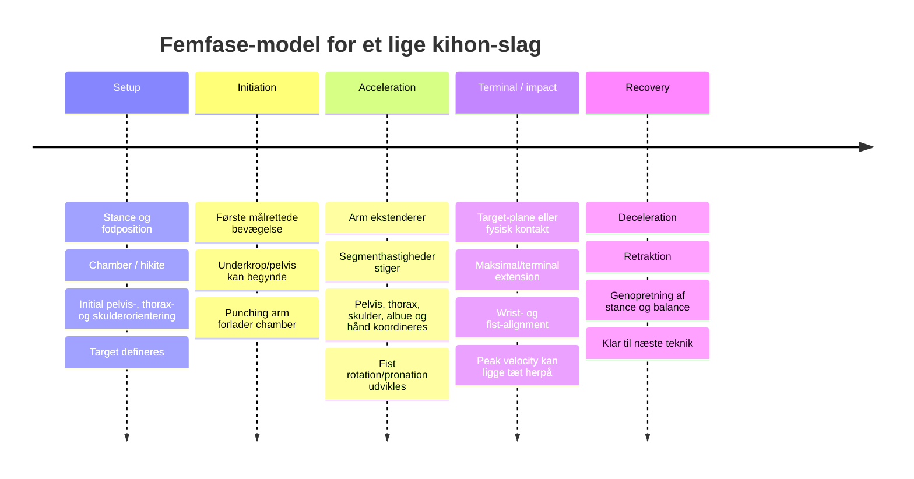
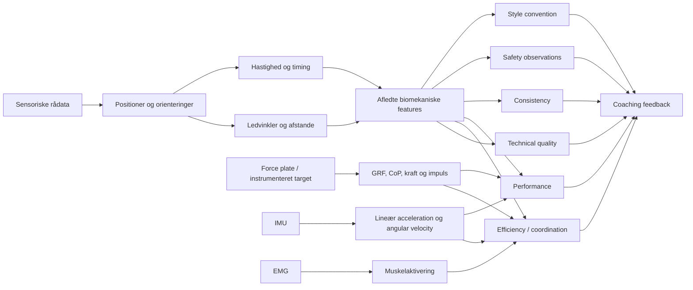

# Biomekanisk og teknisk feature-katalog til en karate-analyzer og digital coach

## Executive summary

En brugbar karate-analyzer bør **ikke** bygges som en binær klassifikator af “korrekt” versus “forkert” kropsstilling. Den videnskabelige litteratur peger stærkere på et system, der måler flere uafhængige dimensioner: **målpræcision, bevægelsesbane, ledkonfiguration, hastighed, timing, proksimal-distal koordination, balance, bilateral asymmetri og reproducerbarhed over gentagelser**. Erfarne karateudøvere adskiller sig fra uerfarne ikke blot ved at bevæge armen hurtigere, men ved anderledes segmentkoordination, større distal hastighed, bedre forhold mellem leveret impuls og destabilisering og mere organiserede bevægelsesmønstre. citeturn16view0turn16view2turn15view4

Den vigtigste arkitektoniske konklusion er derfor:

> **Mål det observerbare først; fortolk det bagefter i kontekst.**

Eksempelvis bør `elbow_angle_terminal = 168°` være et råt resultat. Om det er ønskeligt afhænger af teknik, om slaget udføres i luft eller mod kontakt, udøverens normale ekstensionsgrænse og den valgte stil. Der findes ikke videnskabeligt validerede universelle “korrekt karate”-vinkler for de fleste af de efterspurgte features. Traditionelle manualer kan levere stilregler, men de må ikke forveksles med biomekaniske lovmæssigheder. Japan Karate Associations egen Shotokan-manual specificerer eksempelvis omtrent hoftebred standbredde, omtrent to gange hoftebredde i standlængde og en cirka 60:40-vægtfordeling for zenkutsu-dachi samt bestemte hofteorienteringer; det er værdifulde **Shotokan-konventioner**, men ikke universelle biologiske tærskler. citeturn6view0turn6view1

De videnskabeligt mest forsvarlige første analysekategorier er **target-/endpoint-fejl, bevægelsesbanens direktehed og repeterbarhed, udførelsestid, fist velocity, terminal albueekstension, segmenttiming, balance/stabilitet samt konsistens over gentagelser**. Repeatability er særligt interessant: 3D-analyser af Shotokan choku-tsuki og oi-tsuki har eksplicit vist, at landmark-variabilitet kan kvantificeres og bruges til træningsfeedback. citeturn16view1

**Wrist alignment, fist–forearm alignment, mulig hyperextension, knævalgus og lignende bør inkluderes, men primært som konservative observations-/sikkerhedsflags.** Der mangler karate-specifik prospektiv evidens, som gør det muligt at sige, at eksempelvis “12° håndledsfleksion giver X % skadesrisiko”. Et studie af eliteboksere fandt faktisk gennemsnitlig håndledsfleksion på ca. 9,3° og ulnardeviation på 4,7° under jab-impact, hvilket demonstrerer, at “0° håndled = korrekt, alt andet = forkert” heller ikke er en videnskabeligt forsvarlig generel regel. Disse boksetal bør **ikke** overføres som karate-tærskler. citeturn19search0turn19search2

**Kinetik og kinematik skal holdes adskilt.** Kameraer kan estimere krops- og ledbevægelser, men kan ikke direkte måle ground-reaction force, virkelig center-of-pressure-bevægelse, belastningsfordeling mellem fødderne, slagimpuls eller muskelaktivitet. Et kamera kan derfor give en `weight_shift_proxy`, men ikke legitimt konkludere “63 % af vægten ligger på forreste fod” uden kraftmåling. Direkte karateforsøg med force plates understøtter netop værdien af CoP og slagimpuls som biomekaniske størrelser, mens nyere computer-vision-arbejde med Shotokan-stillinger viser, at torso- og fodgeometri kan bruges som **proxy**, men også understreger, at dette kun er feasibility-data og ikke ground truth. citeturn16view2turn15view8

En anbefalet første produktarkitektur er derfor seks adskilte scores i stedet for én “karate-score”:

| Lag | Hvad det beskriver |
|---|---|
| **Teknisk geometri** | Target, bane, albue, håndled, torso, stance |
| **Dynamik/performance** | Hastighed, acceleration, udførelsestid |
| **Koordination/effektivitet** | Pelvis–thorax–skulder–hånd timing |
| **Motorisk kontrol** | Repeatability, rytme, drift, L/R-symmetri |
| **Stabilitet** | Kropsbevægelse, postural recovery, CoM-proxies |
| **Safety observations** | Mulig hyperextension, wrist collapse, ukontrolleret end-range, balance loss |

Denne struktur passer bedre til evidensen end et enkelt “82/100”-resultat. Den gør det samtidig muligt senere at mappe hver biomekanisk feature mod den faktiske computer-vision-teknologi uden først at lade MediaPipe eller et andet pose-estimeringssystem definere, hvad karate er værd at analysere.

## Analytisk ramme, slagfaser og evidens

I rapporten behandles især **choku-zuki, gyaku-zuki og oi-/junzuki-lignende lige stød**. De er beslægtede, men ikke biomekanisk identiske. Oi-tsuki involverer eksempelvis større helkropstranslation og er i en direkte 3D-sammenligning langsommere og mere variabel end choku-tsuki. Junzuki-studier finder desuden klare bidrag fra underkroppen. Derfor bør tekniktypen være et eksplicit input til analyzeren. citeturn16view1turn16view3



Ved **luft-kihon** bør analyzeren anvende et eksplicit `virtual_terminal_event`, for eksempel det tidspunkt hvor hånden når den programmerede target-plane eller sin maksimale funktionelle fremadrettede position. Det er en designmæssig inference fra den måde kinematiske studier segmenterer slag på; det må ikke kaldes “impact”, hvis intet faktisk rammes. Studier af karate har brugt både no-contact targets, kraftmålte targets og forskellige startafstande, og de målte kinematikker afhænger af opgaven. citeturn15view5turn16view2turn15view4

I de følgende tabeller anvendes domænerne **TK** = teknisk kvalitet, **EFF** = effektivitet/koordination, **PERF** = performance, **KON** = konsistens, **IR** = mulig injury-risk-relevans og **STIL** = stilkonvention.

Evidensskalaen er bevidst konservativ:

| Rating | Betydning |
|---|---|
| **★★★** | Flere direkte karate-studier eller konvergerende direkte karate-evidens understøtter feature-familien |
| **★★** | Direkte karate-evidens findes, men studierne er små/task-specifikke, eller evidensen støttes primært af beslægtet striking-forskning |
| **★** | Primært biomekanisk plausibilitet, én meget lille pilot, traditionel undervisningsregel eller evidens fra anden striking-sport |

Det er **videnskabelig evidens**, ikke graden af traditionel autoritet. En JKA-regel kan derfor være “★ videnskabeligt” men samtidig have høj autoritet, når produktet står i *JKA Shotokan mode*.

For generisk computer vision anvendes **Høj / Middel / Lav / Ikke direkte**. “Høj” betyder ikke nødvendigvis, at en enkelt mobilkameraoptagelse kan gøre det fejlfrit; det betyder, at størrelsen principielt er en forholdsvis direkte kinematisk observation. Moderne Shotokan-feasibility-forskning har allerede operationaliseret blandt andet knævinkler, trunk lean og standgeometri fra kamera-landmarks, men samme studie påpeger problemer med okklusion, out-of-plane-rotation og motion blur og baserer sin kvantitative feasibility på én deltager. citeturn15view8



En vigtig konsekvens er, at analyzeren bør gemme **måling → afledt flag → fortolkning → feedback** som separate lag. Det gør det muligt at ændre coachinglogikken uden at ændre målingen.

## Kernekatalog for kihon-lige stød

Den eksisterende karateforskning er relativt lille. Eksempelvis omfattede VencesBrito et al. 18 erfarne karateka og 19 ikke-karateudøvere; Rinaldis Junzuki-studie ni erfarne udøvere; Sforzas repeatability-studie syv karateka. De kan identificere meningsfulde biomekaniske kandidater, men understøtter sjældent universelle normative tærskler. citeturn16view0turn16view1turn16view3

### Kernefeatures for target, hånd, albue og arm

| Kandidat | Eksakt biomekanisk definition og fase | Domæne | Evidens / generalitet | Vision og sensorer | Rå / normaliseret metric | Tærskel, coaching og safety |
|---|---|---|---|---|---|---|
| **Punch target height** | Vertikal forskel mellem fist-center/striking point og den definerede target-højde ved terminal-event. **T** | TK, PERF, KON, STIL | ★★. Accuracy er direkte undersøgt; selve targetet er task-/stilafhængigt. citeturn15view5 | **Høj**; target skal være kendt/estimeret | `Δy` cm; `Δy/body_height`, `Δy/shoulder_width` | Ingen universel karatehøjde. Jōdan/chūdan osv. skal være task-definition. Feedback: target-grid + speed/accuracy ladder |
| **Lateral target error** | Vinkelret sidefejl mellem fist endpoint og ønsket slaglinje. **T** | TK, PERF, KON | ★★, bred | **Høj**, bedst med kalibreret frontal/3D view | cm; / shoulder width eller target-radius | Task-baseret tolerance. Flag `consistent_left/right_bias` frem for “forkert” |
| **Depth/reach error** | Forskellen mellem fistens terminalposition og target-plane i slagretningen. **T** | TK, PERF, EFF | ★★, bred | **Middel–høj**; depth er vanskelig i ukalibreret enkeltkamera | cm; / arm length | Skal kalibreres til target og distance. Kan skelne `stops_short` fra `overreaches` |
| **Fist endpoint dispersion** | Spredning af terminale fist-positioner over N identiske reps. **T/KON** | KON, TK | ★★★ for repeatability-familien. Landmark-variabilitet er direkte analyseret i karate. citeturn16view1turn14view0 | **Høj** | 2D/3D SD, RMS-radius, covariance ellipse; / body scale | Personlig baseline er bedre end fast threshold. Drill: 10–20 identiske reps med feedback på cluster |
| **Trajectory directness** | Faktisk fist-path-length divideret med euklidisk start→target-afstand; minimum geometrisk = 1,0. **I–A–T** | TK, EFF | ★★. Shotokan-manual kræver straight-forward path for oi-zuki; trajectory-forskning understøtter analyse, men ikke en universel ratio-tærskel. citeturn6view2turn16view1 | **Høj** | `path_length / direct_distance` | 1,0 er geometrisk reference, **ikke** valideret pass/fail. Feedback: “banen bliver 8 % længere end direkte linje” |
| **Lateral/vertical path deviation** | RMS/maximal afstand fra reference- eller start-target-linje i de ortogonale planer. **A** | TK, KON, STIL | ★★ | **Høj**, view-afhængig | cm; / arm length eller shoulder width | Ingen universel threshold; personlig og stilbaseret reference |
| **Trajectory repeatability** | Similaritet mellem hele tidsnormaliserede fist-baner, ikke blot endpoint. **I–T** | KON, TK | ★★★. Repeatability har direkte karate-evidens; 2026 longitudinal pilot viste forbedring af trajectory consistency hos begyndere, men kun fire novices. citeturn16view1turn14view0turn14view2 | **Høj** | RMS distance, trajectory correlation, DTW-distance; normaliseret til arm length | Meget stærk personlig progress-metric; undgå krav om identisk rigid bane |
| **Wrist flexion/extension** | Håndens sagittale vinkel relativt til underarmen, især ved **T** | TK, IR | ★ karate-specifikt; ★★ adjacent striking. Eliteboksere har målbar fleksion ved impact, så 0° er ikke universelt. citeturn19search0turn19search2 | **Lav–middel** med almindelig body pose; **middel–høj** med 3D hand/wrist; elektromagnetisk tracker/IMU bedre | °; evt. / individuel aktiv ROM | Ingen karate-threshold. Kalibrér neutral og ROM. `possible_wrist_collapse` bør have lav/moderat safety-confidence |
| **Radial/ulnar wrist deviation** | Frontal-plan afvigelse af håndens længdeakse relativt til forearm. **T** | TK, IR | ★/★★ adjacent. Jab-boksere viste ca. 4,7±1,2° ulnardeviation i ét elite-studie; **ikke karate-reference**. citeturn19search0 | **Lav–middel** kamera; elektromagnetisk tracking kan måle det reliabelt. citeturn19search3 | °; / individuel ROM | Individuel kalibrering. Safety-flag kun som observationsflag |
| **Fist–forearm alignment** | 3D-vinkel mellem håndens/fistens longitudinale akse og forearm-aksen; kan opløses i flex/ext og radial/ulnar komponenter. **T** | TK, IR | ★–★★; biomekanisk relevant, men mangel på karate-specifik outcome-evidens | **Middel** med synlig hånd og 3D; højopløseligt hand tracking ønskeligt | ° total + plan-komponenter | Ingen universel “0°”-regel. Feedback bør beskrive retning og afvigelse |
| **Terminal fist orientation** | Håndens rotation omkring forearms-/slagaksen ved T | TK, STIL | ★–★★. Forearmspronation adskiller erfarne karateka fra ikke-karateudøvere, men eksakt terminal orientering er stilafhængig. citeturn16view0 | **Lav–middel** generisk body-CV; hand model/IMU bedre | quaternion/roll angle; Δrotation fra setup | Stilprofil nødvendig |
| **Pronation ROM og timing** | Total forearmsrotation og tidspunkt for dens udvikling relativt til armextension/terminal-event. **A–T** | TK, EFF, STIL | ★★. Direkte choku-zuki-data viser forskelle i pronationsmønster mellem erfarne og kontroller. citeturn16view0 | **Lav–middel** kamera; IMU giver bedre rotation | °, peak angular velocity, `% punch duration` | Brug personlig/stilreference; ikke “drej præcis X°” |
| **Terminal elbow angle** | Intern vinkel over skulder–albue–hånd; convention kan sætte 180° = fuld geometrisk extension. **T** | TK, PERF, IR, STIL | ★★. Elbow ROM/impact angle er målt direkte, men studiers angle-convention varierer. citeturn16view3 | **Høj** i passende plan; 3D ved out-of-plane | ° | Ingen universel karate-threshold. JKA beskriver ved kontakt en let bøjet albue snarere end matematisk lockout. citeturn6view4 |
| **Extension reserve** | Afstand i grader mellem individets kalibrerede terminale anatomiske extension og slagets terminale elbow angle. **T** | TK, IR | ★ for skadeprediction; stærk måleidé | **Høj** efter individuel baseline | `personal_max_extension - punch_angle` | Skal individualiseres. Mere meningsfuld end fast `180°`-grænse |
| **Possible hyperextension** | Slagets observerede elbow extension overskrider individets kalibrerede normale terminalrange ud over måleusikkerhed. **T–R** | IR, TK | ★. Ingen identificeret valideret karate-threshold for skade | **Middel–høj**, men measurement error kritisk | ° ud over baseline + angular velocity ved end-range | Red flag: `possible_ballistic_end_range`; **lav/moderat confidence**, ikke diagnose. Brug langsommere end-range-kontrol og korrekt target-distance |
| **Elbow flare** | Albues laterale/perpendikulære afstand fra det tilsigtede shoulder–fist/strike-plane eller upper-armens out-of-plane-vinkel. **A** | TK, EFF, STIL | ★. Almindelig teknisk coachingidé, men svag karate-specifik outcome-evidens | **Høj** frontal/3D | ° eller cm; / arm length | Stil-/coach-threshold. Giv helst gradient feedback fremfor “fejl” |
| **Arm reach ratio** | Shoulder–fist-afstand divideret med kalibreret maksimal funktionel shoulder–fist-reach. **A–T** | TK, EFF, KON | ★★ som afledt kinematic | **Høj** | 0–1 eller % | Individuel baseline. Kan skelne “underextension” fra bevaret extension reserve |
| **Arm extension timing** | Tid for elbow-extension onset/peak angular velocity relativt til punch onset og T. **I–A** | EFF, PERF | ★★–★★★ som del af segmentkoordination. Karateexperter udviser anderledes intersegmental timing. citeturn15view4turn16view0 | **Middel–høj**, høj temporal opløsning ønskelig | ms; % movement duration | Person-/task-reference; coaching: sekvens frem for statisk slutpose |

Den mest praktiske observation her er, at **target, path og endpoint bør behandles separat**. En udøver kan have en meget direkte bane, men konsekvent slutte fem centimeter over målet; en anden kan ramme det korrekte endpoint via en unødigt buet bane. De er biomekanisk og pædagogisk forskellige problemer.

### Skulder, trunk, pelvis og segmentsekvensering

| Kandidat | Definition og fase | Domæne | Evidens / generalitet | Vision/sensor | Metric / normalisering | Coachingfortolkning |
|---|---|---|---|---|---|---|
| **Shoulder elevation** | Vertikal elevation af punching shoulder relativt til thorax/kontralateral shoulder. **I–T** | TK, EFF | ★ | **Høj** for grov proxy | Δshoulder-y / shoulder width; evt. shoulder-line tilt korrigeret for trunk | Flag primært ved systematisk stigning fra egen baseline; undgå at kalde det “tension”, som kamera ikke kan måle |
| **Shoulder protraction/forward travel** | Anterior bevægelse af skuldercentret relativt til thorax. **A–T** | TK, PERF, EFF | ★★ | **Middel**; 3D foretrækkes | cm eller % arm length | Skeln nyttig reach fra hele-trunk overreach |
| **Shoulder axial rotation** | Humeral intern/ekstern rotation omkring overarmens længdeakse. **A–T** | TK, EFF | ★★ for at rotation indgår; eksakt “rigtig” amplitude ikke fastlagt. citeturn16view0 | **Lav** fra grov skeleton; marker/IMU bedre | °, angular velocity | Bør ikke være tidlig MVP-flag fra almindelig video |
| **Forward torso lean** | Sagittal vinkel mellem trunk-axis og lodret. **S–R** | TK, EFF, STIL | ★–★★. JKA instruerer oprejst upper body/no forward lean i relevante basisøvelser; det er stilkonvention. citeturn6view0turn6view3 | **Høj** sideview | °; Δ fra setup | God coachable metric; baseline/stilprofil |
| **Backward torso lean** | Trunk-akse bevæger sig væk fra target under fremadrettet punch. **A–T** | EFF, BAL | ★★ indirekte koblet til stabilitet | **Høj** | ° og trunk COM displacement | Kan være kompensation; fortolk sammen med fist reach |
| **Lateral torso lean** | Frontal-plan trunk-angle. **S–R** | TK, BAL, KON | ★ | **Høj** frontal view | ° | Personlig repeatability-metric før normativt flag |
| **Thorax axial rotation** | Transversal rotation af shoulder/thorax segment relativt til global target-axis. **I–T** | EFF, PERF, STIL | ★★ | **Middel** enkeltkamera, **højere** multi-view/3D | ROM °, angular velocity | Mål både magnitude og timing; “mere rotation” er ikke automatisk bedre |
| **Pelvis axial rotation** | Transversal rotation af pelvis segment relativt target-axis. **I–T** | EFF, PERF, STIL | ★★–★★★ som performance-relevant helkropsparameter. Junzuki-data dokumenterer lower-body/trunk bidrag. citeturn16view3 | **Middel**; 3D foretrækkes | ROM °, angular velocity | Eksakt magnitude er teknik-/stilafhængig |
| **Hip–shoulder separation** | `thorax axial angle − pelvis axial angle`. **I–A–T** | EFF, PERF | ★★ | **Middel–høj** 3D | ° peak + curve over tid | Kan vise trunk “lag” eller samlet rotation, men ikke automatisk kvalitet |
| **Pelvis→thorax timing** | Lag mellem onset eller peak angular velocity i pelvis og thorax. **I–A** | EFF | ★★ | **Middel**, kræver god temporal 3D | ms; / total punch time | Feedback: “pelvis og overkrop bevæger sig mere/mindre simultant end din reference” |
| **Shoulder→wrist peak-velocity lag** | `t_peak(wrist) − t_peak(shoulder)`. **A** | EFF, PERF | ★★★. Karate black belts var bedre til intersegmental timing, og shoulder–wrist peak timing var en central discriminant. citeturn15view4 | **Middel–høj**; høj fps forbedrer temporal præcision | ms; % punch duration | Top-tier coach metric. Undgå en universel ms-threshold før eget datasæt |
| **Pelvis→wrist lag** | Temporal forskel mellem peak pelvis angular velocity og peak fist velocity. **I–A** | EFF, PERF | ★★ | **Middel** | ms/% | God kinetic-chain proxy, men bør valideres pr. teknik |
| **Segment sequence classification** | Ordnet sequence af peak/onset-events for pelvis, thorax, shoulder, elbow, wrist. **I–A** | EFF, PERF, KON | ★★–★★★ for værdien af intersegmental timing, men ikke for én universel sekvens. Studier har observeret både mere simultane og mere sekventielle gyaku-zuki-strategier. citeturn15view4turn21search16 | **Middel** | event-order + lag-vector | Klassificér mønster før evaluering. Det er farligt at kode “pelvis altid først” som absolut lov |

Dette sidste punkt er centralt. Expert-forskningen understøtter **koordination**, men ikke nødvendigvis én universel “proksimal→distal opskrift” med faste grader og millisekunder. Et gyaku-zuki-studie af eliteudøvere identificerede forskellige simultane og sekventielle clusters, og en nyere meget lille gyaku-zuki-pilot fandt, at forskellige tekniske varianter havde forskellig pelvis-/thorax-ROM og hand velocity; den variant med størst bevægelsesudslag var ikke nødvendigvis den hurtigste. Den sidste undersøgelse var kun et single-subject pilotstudie og bør derfor vægtes ★. citeturn21search16turn6view6

### Stance, knæ, balance og weight shift

| Kandidat | Definition og fase | Domæne | Evidens / generalitet | Vision/sensor | Metric | Tærskel / coaching / safety |
|---|---|---|---|---|---|---|
| **Stance width** | Mediolateral afstand mellem fodreferencer i setup/terminal stance. **S/T** | TK, BAL, STIL | ★ biomekanisk normativt; høj style-authority. JKA zenkutsu ≈ hoftebredde. citeturn6view0 | **Høj**, hvis perspektiv korrigeres | distance / hip width | Style threshold. Ikke universelt på tværs af karate |
| **Stance length** | Anteroposterior afstand mellem fødder. **S/T** | TK, BAL, STIL | ★/★★; JKA ≈ 2× hip width for zenkutsu. citeturn6view0 | **Middel–høj** | / hip width, / leg length | Style-specific |
| **Front/rear knee flexion** | Sagittal knævinkel under setup, acceleration og T. | TK, PERF, STIL | ★★. Junzuki-force korrelerede med knæfleksion ved impact og lower-limb force i n=9. citeturn16view3 | **Høj** | °, ROM ° | Studiets konkrete vinkler må ikke genbruges som universal threshold pga. koordinatsystem/task |
| **Knee–foot alignment** | Frontal/transversal relation mellem knæcentrum og fod/ankelakse. **S–T** | TK, IR, STIL | ★ karate-specifikt | **Middel**; 2D giver kun proxy | knee–ankle horizontal offset / leg length; angle | Safety-flag med lav confidence. Anatomiske og stilrelaterede variationer kræver forsigtighed |
| **Dynamic knee medial/lateral excursion** | Maksimal frontal-plan knæbevægelse relativt til fod under vægtoverførsel. **I–T** | IR, KON | ★ i karate | **Middel** | cm/leg length | Observationsflag, ikke “injury diagnosis” |
| **Foot orientation** | Foot-axis relativt til target/stance-axis. **S/T** | STIL, TK | ★; stærkt stilafhængig | **Middel–høj** med synlige tæer/hæl | ° | Konfigureres fra style manual/coach |
| **Rear-heel lift** | Hælen mister kontakt eller ændrer vertikal position. **I–T** | STIL, EFF | ★ | **Høj** visuelt, men gulvkontakt kan være usikker | heel-to-floor distance / foot length | Style-/technique-specific; ikke universelt red flag |
| **Pelvic height change** | Vertikal pelvis/CoM-proxy displacement under teknik. **S–R** | EFF, TK, KON | ★★ som helkropskinematik | **Høj** | Δy / leg length | God consistency-metric; stilfortolkning separat |
| **Body forward translation** | Pelvis/trunk/estimeret CoM bevægelse mod target. **I–T** | EFF, PERF | ★★ | **Høj** | cm / leg length | Særligt relevant oi-/junzuki; mindre normativt ved stationary choku-zuki |
| **Head displacement** | 2D/3D hovedtranslation fra setup til T/R. | BAL, KON | ★★ som stabilitetsproxy | **Høj** | cm / body height | “Mindre” er ikke automatisk bedre; fortolk relativt output/teknik |
| **Post-punch sway** | Pelvis/trunk/head-oscillation efter T. **R** | BAL, KON | ★★ | **Høj** | RMS displacement/velocity i recovery-window | Feedback: “du bruger længere tid på at stabilisere efter venstre slag” |
| **Recovery stabilization time** | Tid fra T til trunk/pelvis velocity falder under individuel stabilitetsgrænse. **R** | BAL, EFF, KON | ★★ | **Høj** | ms; / execution time | Individualiseret threshold |
| **Projected CoM margin** | Estimeret kropscenterprojektion relativt til support polygon. **S–R** | BAL, EFF | ★★ som proxy, ikke ægte kinetik | **Middel** | distance til support-base boundary / foot length | Kan bruges som kamera-proxy; må ikke kaldes CoP |
| **Weight-shift proxy** | Ændring i pelvis/torso-projektion og benkonfiguration, der **indirekte** indikerer belastningsskift. **I–T** | EFF, STIL | ★–★★ | **Middel** | normalized projected position 0–1 mellem fødder | Et nyere Shotokan-system bruger torso–support-base intersection som proxy; forfatterne betegner selv studiet som feasibility med én deltager. citeturn15view8 |
| **True weight distribution / GRF** | Vertikal/horizontal ground-reaction force under hver fod. | PERF, EFF | ★★–★★★ biomekanisk relevant | **Ikke direkte kamera** | N, N/kg, %BW | **Force plates/instrumenterede indlæg** nødvendige |
| **Center of pressure** | Kraftresultantens kontaktpunkt og dets migration gennem slaget. **S–R** | BAL, EFF | ★★ direkte karate. Experts havde mindre backward CoP displacement pr. leveret impuls. citeturn16view2 | **Ikke direkte kamera** | mm, path length, area; evt. / foot length eller punch impulse | Force plate nødvendig. Kamera-“balance” er ikke samme variabel |

Cesari og Bertuccos resultat er særligt relevant for produktdesignet: experterne genererede større upper-limb velocity og punch impulse, men havde mindre backward CoP displacement **per unit impulse**. Det antyder, at en fremtidig analyzer bør søge et koncept som **performance relativt til destabilisering**, ikke blot belønne en krop, der står helt stille. citeturn16view2

### Hikite, hastighed, acceleration, timing, rytme og gentagelser

| Kandidat | Definition/fase | Domæne | Evidens | CV/sensor | Metric | Fortolkning |
|---|---|---|---|---|---|---|
| **Hikite endpoint** | Retracting hand terminalposition relativt til hofte/ribben/chamber-reference. **T** | TK, STIL, KON | ★ videnskabeligt; høj style-authority i nogle systemer. JKA beskriver hand-to-hip under gyaku-zuki. citeturn6view1 | **Høj** | 3D offset / torso width | Style-configurable; bør ikke kaldes universel biomekanisk fejl |
| **Hikite onset lag** | `t_retracting_hand_onset − t_punching_hand_onset`. **I** | TK, EFF, STIL | ★ | **Høj** | ms/% | God stil- og coordination-metric, men ingen etableret universel optimal lag |
| **Hikite peak velocity** | Maks. retraktionshastighed. **A/T** | PERF?, STIL, KON | ★ | **Høj** | m/s, / arm length·s⁻¹ | Primært descriptive |
| **Hikite endpoint consistency** | Dispersion af chamberposition over reps. **T/R** | KON, STIL | ★★ via generel repeatability-logik | **Høj** | SD cm / torso width | Meget velegnet coach metric uden normative antagelser |
| **Total execution time** | Punch onset → virtual/physical terminal event. **I–T** | PERF, KON | ★★★. Execution time anvendes direkte i karate-studier; choku-zuki kinematics/EMG foregik inden for ca. 400 ms i VencesBrito-studiet. citeturn16view0turn15view5 | **Høj** | ms | Task-specifik; 400 ms er **ikke** pass/fail-threshold |
| **Peak fist velocity** | Maksimal lineær fist-speed i relevant direction/resultant. **A/T** | PERF | ★★★. Experts/practitioners viser højere velocity i flere direkte karate-studier. citeturn16view2turn15view5turn14view0 | **Middel–høj**; kalibrering og frame rate vigtige | m/s; evt. / arm length·s⁻¹ | Benchmark mod personlig historik og samme task |
| **Terminal velocity** | Fist velocity ved target-plane/impact-frame. **T** | PERF | ★★★ familie | **Middel–høj** | m/s | Bedre koblet til leveringsøjeblik end global peak, især hvis peak optræder tidligere |
| **Peak acceleration** | Maks. afledt lineær fistacceleration. **A** | PERF | ★★–★★★; punch acceleration er direkte undersøgt blandt elitekarateka og korrelerer med strength/power. citeturn21search1 | **Middel/lav** fra almindelig video pga. dobbelt numerisk sensitivitet; **IMU/høj-fps 3D foretrækkes** | m/s² eller g | Sammenlign kun ens sensor/protokol. Ingen universel karate-threshold |
| **Time to peak velocity** | Onset → peak fist velocity. **A** | PERF, EFF | ★★★ | **Høj** temporal | ms eller % movement | Reactive punches har kortere time-to-peak end self-initiated i et direkte studie. citeturn15view5 |
| **Normalized peak timing** | `t_peak_velocity / execution_time`. | EFF, KON | ★★. En 2026 longitudinal pilot med kun 4 novices + 1 expert rapporterede expert peak omkring 85–90 % af punch movement. citeturn14view1turn14view5 | **Høj** | 0–1/% | Interessant **exploratory reference**, ikke norm |
| **Deceleration onset** | Første vedvarende negative longitudinal acceleration før T. **A–T** | EFF, PERF | ★★ | **Middel**, IMU/high-fps foretrækkes | % movement, ms før T | Kan finde for tidlig braking, men no-contact punch kræver kontekst |
| **Braking fraction** | Andel af punch acceleration-phase med deceleration før T. | EFF, KON | ★–★★ | **Middel** | duration decel / acceleration phase | Task-specific, særlig forskel air-kihon vs impact |
| **Reaction time** | External cue timestamp → movement onset. | PERF | ★★ direkte karate | **Høj**, hvis cue timestamp kendes | ms | Ikke en teknik-kvalitetsmetric; separér fra movement time. citeturn15view5 |
| **Inter-punch interval** | Tidsafstand mellem homologe events i gentagne stød/combinations. | KON, PERF, STIL | ★–★★ | **Høj** | ms | Relevant for rhythm/cadence |
| **Rhythm variability** | SD/CV af inter-punch interval eller fasevarigheder. | KON | ★–★★ | **Høj** | CV %, SD ms | Person-/drill-specifik, ikke universal karate rule |
| **L/R velocity asymmetry** | Eksempel: `100×(R−L)/((R+L)/2)`. | KON, PERF | ★★; IMU-data viser, at dominant og ikke-dominant arm kan adskille sig, men ikke ensartet hos alle udøvere. citeturn21search5 | **Høj/Middel** afhængig af velocity measurement | % | Rapporter asymmetri som observation; ingen valideret universel “10 % = dårlig” threshold |
| **L/R geometry asymmetry** | Forskel R-L for endpoint, elbow, trunk osv. | TK, KON | ★–★★ | **Høj** | absolut difference eller symmetry index | Personlig udviklingsmetric frem for patologisk flag |
| **Speed consistency** | SD/CV af peak/terminal velocity over identiske reps. | KON, PERF | ★★★ repeatability-familie | **Høj** | CV % | God session/progress metric |
| **Timing consistency** | SD af execution time og segment-lags over reps. | KON, EFF | ★★★ familie | **Høj** | ms eller normalized SD | Meget relevant for expertise |
| **Fatigue/drift** | Slope over rep-nummer for velocity, endpoint, stance eller timing. | KON, PERF | ★★; IMU-metoder er velegnede til temporal analyse af gyaku-zuki. citeturn21search0turn21search3 | **Høj** for kinematics; IMU stærk til acceleration | % change/rep eller regression slope | Coach: stop drill når kvalitet falder systematisk, threshold kalibreres til formål |

Det er værd at fremhæve, at **hastighed og accuracy ikke nødvendigvis er et simpelt trade-off**. I et karateforsøg gav reactive punches både kortere movement time/time-to-peak og bedre accuracy end self-initiated punches, mens karategruppen havde højere peak velocity end kontrolgruppen. Det understreger, at analyzeren bør kende drill-konteksten i stedet for at antage, at enhver hurtigere bevægelse nødvendigvis er mindre kontrolleret. citeturn15view5

Den nyere longitudinale undersøgelse fra 2026 er interessant, fordi fire begyndere over fire måneders træning forbedrede peak velocity, trajectory consistency og self-consistency, mens skarpe acceleration-/timingmønstre udviklede sig langsommere. Men datagrundlaget var kun fire novices og én expert, ingen impact target blev anvendt, og analyserne var hovedsageligt deskriptive. Dens ~85 % peak-timing og hastighedstal bør derfor bruges til hypotesedannelse, ikke som produktions-tærskler. citeturn14view0turn14view2turn14view3turn14view4

Et potentielt stærkt læringsprincip er således:

> **Begyndere kan først lære hvor bevægelsen skal gå og øge hastigheden; raffineret temporal organisation kan komme senere.**

Dette er konsistent med den lille longitudinale undersøgelse og med ældre expert–novice-studier, der viser forskelle i intersegmental koordinering og upper-limb kinematics. citeturn14view3turn15view4turn16view0

## Sammenligning, prioritering og coachinglogik

Følgende rangering kombinerer fire ting: biomekanisk fortolkelighed, karate-specifik evidens, reel coachingværdi og mulighed for senere robust måling. **CV-feasibility er medtaget, men har ikke fået lov at definere biomekanisk relevans.**

| Prioritet | Feature-familie | Coachingværdi | Evidens | CV-feasibility | Hvorfor den bør prioriteres |
|---:|---|:---:|:---:|:---:|---|
| 1 | **Target / endpoint accuracy** | 5/5 | ★★ | Høj | Direkte, let forståelig og task-definerbar |
| 2 | **Endpoint consistency** | 5/5 | ★★★ | Høj | Skelner systematisk bias fra variabilitet |
| 3 | **Trajectory repeatability** | 5/5 | ★★★ | Høj | Direkte karate-evidens og meget egnet til progress tracking |
| 4 | **Trajectory directness/deviation** | 5/5 | ★★ | Høj | Passer naturligt til straight-punch coaching |
| 5 | **Execution time** | 5/5 | ★★★ | Høj | Robust performance/timing-metric |
| 6 | **Peak + terminal fist velocity** | 5/5 | ★★★ | Middel–høj | Stærk direct performance relevance |
| 7 | **Shoulder–wrist peak timing** | 5/5 | ★★★ | Middel–høj | Direkte expertise-/coordination-evidens. citeturn15view4 |
| 8 | **Terminal elbow angle / extension reserve** | 5/5 | ★★ | Høj | Teknisk og mulig safety-relevans; let at coache |
| 9 | **Whole-chain timing** | 5/5 | ★★–★★★ | Middel | Mere biomekanisk informativt end faste hip-angle-regler |
| 10 | **Balance / postural recovery** | 5/5 | ★★ | Høj som proxy | Direct karate-resultat viser performance–stability coupling. citeturn16view2 |
| 11 | **Pelvis/thorax rotation timing** | 4/5 | ★★ | Middel | Bedre mål end “mere hip rotation” |
| 12 | **Acceleration profile** | 4/5 | ★★–★★★ | Middel | Performance- og motor-learning-værdi; sensorkrævende |
| 13 | **Wrist/fist–forearm alignment** | 4/5 | ★–★★ | Middel/lav | Høj intuitiv teknik-/safetyværdi, men svag karate-threshold-evidens |
| 14 | **Torso lean** | 4/5 | ★–★★ | Høj | Meget coachable og egnet til style-mode |
| 15 | **L/R asymmetry** | 4/5 | ★★ | Høj | Stærkt progressværktøj uden at kræve normativ “perfekt symmetry” |
| 16 | **Stance width/length** | 4/5 | ★–★★ | Høj | Vigtigt for kihon; især style-specific |
| 17 | **Knee flexion/alignment** | 4/5 | ★★ / ★ safety | Høj–middel | Lower-body contribution dokumenteret; safetyfortolkning konservativ |
| 18 | **Hikite timing/endpoint** | 3/5 | ★ | Høj | Relevant for traditionel kihon, men primært style convention |
| 19 | **Rhythm/cadence consistency** | 3/5 | ★–★★ | Høj | Nyttigt ved serier og combinations |
| 20 | **Fatigue / quality drift** | 4/5 | ★★ | Høj | Gør analyzeren til træningsværktøj frem for snapshot-vurdering |

Den største metodiske gevinst fås ved at adskille **accuracy** og **precision**:

\[
\text{Accuracy} = \text{afstand til det ønskede mål}
\]

\[
\text{Precision/consistency} = \text{spredning mellem egne gentagelser}
\]

En karateka kan således være **meget konsistent men forkert kalibreret**:

> alle ti slag 6 cm over target.

Eller gennemsnitligt korrekt men motorisk ustabil:

> slagene ligger spredt ±8 cm omkring target.

De to mønstre kræver forskellig coaching. Sforzas 3D-arbejde viser netop, at spredningen af landmarks kan behandles kvantitativt og kan identificere kropsdele med utilstrækkelig repeatability. citeturn16view1

Et godt feedbacksystem bør derfor primært formulere **observerbar feedback**:

> “Din højre hånd slutter i gennemsnit 4,1 cm over det valgte target.”

> “Din endpoint-spredning er faldet 23 % siden sidste session.”

> “Peak velocity er ens på højre og venstre, men venstre side har større variation.”

> “Din skulder–hånd peak-timing er mere variabel på venstre side.”

og være mere forsigtigt med kausale udsagn:

> “Du mister kraft fordi hoften roterer for lidt.”

Det sidste kan kameraet normalt ikke bevise. Rinaldis studie fandt eksempelvis en **negativ** korrelation mellem maksimal trunk angular acceleration og punch force i deres Junzuki-protokol, samtidig med positive relationer mellem punch force, knee flexion og lower-limb forces. Det viser netop, hvorfor “mere rotation = mere power” er for simplistisk. citeturn16view3

En praktisk feedbackhierarki kunne være:

| Niveau | Analyzer må gerne sige | Analyzer bør undgå |
|---|---|---|
| **Measurement** | “Elbow angle ved terminal frame: 174°” | — |
| **Pattern** | “5/6 reps ligger tæt på din kalibrerede end-range” | — |
| **Technique interpretation** | “Du arbejder meget tæt på fuld extension” | “Din albue er anatomisk forkert” |
| **Safety observation** | “Mulig gentagen ballistic end-range; reducer hastighed og få teknikken vurderet ved smerte/ubehag” | “Du vil få en albueskade” |
| **Performance** | “Terminal velocity steg 7 % uden større endpoint-spredning” | “Du slår 7 % hårdere”, medmindre impact force faktisk er målt |

For **possible hyperextension, wrist collapse og knee alignment** anbefales confidence-feltet `low / moderate / high`. Kamera alene bør kun generere et high-confidence safety-flag, hvis den geometriske observation i sig selv er robust; den bør stadig ikke omsættes til en medicinsk risikovurdering uden evidens.

Et progressionsorienteret træningssystem kan derimod være meget aggressivt med **konsistensfeedback**, fordi det ikke kræver påstanden om én universel korrekt teknik:

| Observeret mønster | Coach-fortolkning | Egnet drill |
|---|---|---|
| Stor target-bias, lav variation | Teknikken er reproducerbar, men targetkalibreringen er forkert | Target-grid, langsom→hurtig progression |
| Lille target-bias, høj variation | Gennemsnittet er godt; motorisk precision mangler | 10-rep clusters med live dispersion |
| Lang/looping fist path | Unødvendig bane for en straight-punch task | Visuel centerline/target-linje, langsom kontrol |
| Hurtig højre, langsom venstre | Bilateral performance-asymmetri | Matchede L/R-set; mål ændringen over uger |
| Samme speed, forskellig timing | Output ens, coordination strategy forskellig | Segmenttiming-feedback frem for mere styrke |
| Stor post-punch sway | Teknikken kræver meget recovery | Punch→freeze drill; derefter punch→next-technique |
| Høj speed men større endpoint-spredning | Speed-accuracy-control trade-off hos individet | Speed ladder ved bevaret tolerance |
| Stabil statisk geometri, ustabil acceleration | Grov form etableret, dynamisk organisering mindre stabil | Submaksimal→eksplosiv progression med velocity timing |

## Foreslået masterkatalog og dataschema

Masterkataloget bør være **sensor-agnostisk**. Det skal beskrive, hvad karateanalyzeren principielt ønsker at vide; sensorlaget bestemmer senere, om resultatet kan produceres fra RGB-video, multi-view, depth camera, IMU, force plate eller instrumenteret target.

Et katalog på omkring **72 features** er en passende første arbejdsstørrelse:

| Featuregruppe | Foreslåede feature-ID'er |
|---|---|
| **Target og endpoint** | `target_height_error`, `target_lateral_error`, `target_depth_error`, `endpoint_xyz`, `endpoint_dispersion`, `endpoint_direction_bias`, `target_hit_rate`, `target_plane_crossing_time` |
| **Fist trajectory** | `path_directness`, `path_length_norm`, `path_lateral_rms`, `path_vertical_rms`, `path_max_deviation`, `path_curvature`, `path_repeatability`, `trajectory_correlation` |
| **Wrist/fist** | `wrist_flexion_terminal`, `wrist_flexion_peak`, `wrist_ulnar_radial_terminal`, `fist_forearm_alignment`, `fist_orientation_terminal`, `forearm_pronation_rom`, `forearm_pronation_timing`, `forearm_angular_velocity_peak` |
| **Elbow/arm** | `elbow_angle_terminal`, `elbow_extension_reserve`, `elbow_hyperextension_event`, `elbow_flare_peak`, `elbow_path_repeatability`, `arm_reach_ratio`, `arm_extension_onset`, `arm_extension_peak_time` |
| **Shoulder** | `shoulder_elevation_peak`, `shoulder_elevation_terminal`, `shoulder_protraction`, `shoulder_forward_travel`, `shoulder_axial_rotation_proxy`, `shoulder_velocity_peak`, `shoulder_path_repeatability`, `shoulder_wrist_peak_lag` |
| **Trunk/pelvis** | `trunk_forward_lean`, `trunk_lateral_lean`, `thorax_rotation_rom`, `pelvis_rotation_rom`, `hip_shoulder_separation_peak`, `pelvis_rotation_peak_time`, `thorax_rotation_peak_time`, `pelvis_thorax_phase_lag` |
| **Stance/lower body** | `stance_width_norm`, `stance_length_norm`, `front_knee_flexion`, `rear_knee_flexion`, `front_knee_foot_alignment`, `rear_knee_foot_alignment`, `front_foot_angle`, `rear_foot_angle` |
| **Balance/weight shift** | `pelvis_height_change`, `body_forward_translation`, `head_displacement`, `com_projection_margin`, `weight_shift_proxy`, `post_punch_sway`, `stabilization_time`, `true_cop_displacement` |
| **Hikite/recovery** | `hikite_endpoint`, `hikite_onset_lag`, `hikite_peak_velocity`, `hikite_path_directness`, `hikite_endpoint_dispersion`, `retraction_time`, `return_to_guard_time`, `recovery_path_repeatability` |
| **Dynamics/timing** | `execution_time`, `fist_peak_velocity`, `fist_terminal_velocity`, `fist_peak_acceleration`, `time_to_peak_velocity`, `peak_velocity_phase`, `deceleration_onset`, `braking_fraction` |
| **Series/symmetry** | `inter_punch_interval`, `rhythm_cv`, `velocity_cv`, `timing_cv`, `lr_velocity_asymmetry`, `lr_endpoint_asymmetry`, `lr_coordination_asymmetry`, `fatigue_velocity_slope` |

Nogle features overlapper bevidst. `wrist_flexion_terminal` er eksempelvis et konkret råt geometrisk mål, mens `fist_forearm_alignment` er et mere sammensat output. Det er ønskeligt, fordi senere modeller kan testes på, hvilke niveauer der giver mest robust feedback.

Det anbefalede schema er:

| Felt | Funktion |
|---|---|
| `id` | Stabil machine-readable identifier |
| `name` | Human-readable dansk/engelsk navn |
| `technique` | Fx `straight_punch`, `choku_zuki`, `gyaku_zuki`, `oi_zuki` |
| `phase` | En eller flere af `setup`, `initiation`, `acceleration`, `terminal`, `recovery` |
| `raw_metric` | Hvad der direkte beregnes |
| `normalized_metric` | Antropometrisk eller temporal normalisering |
| `derived_flags` | Fx `high`, `variable`, `left_bias`, `possible_hyperextension` |
| `interpretation` | Hvad feature biologisk/teknisk betyder |
| `evidence` | ★/★★/★★★ + references |
| `generality` | `broad`, `technique_specific`, `style_specific`, `coach_specific` |
| `CV_feasibility` | `high`, `medium`, `low`, `not_direct` |
| `sensors_required` | RGB, multi-view, 3D mocap, IMU, force plate osv. |
| `calibration_needed` | `none`, `task`, `individual`, `style`, `camera`, kombination |
| `coaching_tip` | Tilladt feedbackform |
| `safety_flag` | `false` eller flagtype + confidence |

Her er ti fuldt udfyldte referenceentries. Første halvdel beskriver måling/evidens:

| id | name | technique | phase | raw_metric | normalized_metric | derived_flags | evidence |
|---|---|---|---|---|---|---|---|
| `punch.target.height_error` | Vertikal target-fejl | straight punch | terminal | Fist target-y difference i cm | `Δy / shoulder_width` | `high`, `low`, `variable` | ★★; accuracy undersøgt direkte. citeturn15view5 |
| `punch.path.directness` | Slagbanens direktehed | straight punch | initiation→terminal | path length / straight-line distance | Allerede dimensionsløs | `looping`, `direct`, `variable` | ★★; trajectory/repeatability + style evidence. citeturn16view1turn6view2 |
| `punch.elbow.extension_reserve` | Albue-extension reserve | straight punch | terminal | Forskel fra individuel calibrated max extension | grader / personlig ROM | `near_end_range`, `comfortable_reserve` | ★★ for elbow kinematics; safetyimplikation ★. citeturn16view3 |
| `punch.elbow.possible_hyperextension` | Mulig ballistic hyperextension | air straight punch | terminal→recovery | angle beyond personal max + terminal angular velocity | grader over baseline / ROM | `possible_ballistic_end_range` | ★ for skadeprediction |
| `punch.wrist.forearm_alignment` | Fist–forearm alignment | straight punch | terminal | 3D hånd–forearm vinkel | / individuel ROM | `flexed`, `extended`, `ulnar`, `radial` | ★ karate / ★★ adjacent boxing. citeturn19search2turn19search3 |
| `punch.shoulder_wrist.peak_lag` | Shoulder–wrist velocity peak lag | straight punch | acceleration | `t_wrist_peak − t_shoulder_peak` | / execution time | `high_lag`, `low_lag`, `unstable_lag` | ★★★. citeturn15view4 |
| `punch.balance.stabilization_time` | Recovery-stabilisering | straight punch | recovery | tid til trunk/pelvis velocity under baseline tolerance | / punch time | `slow_recovery`, `stable` | ★★; direct stability evidence. citeturn16view2 |
| `punch.hikite.endpoint` | Hikite endpoint | kihon straight punch | terminal | Retracting-hand offset fra style-defined chamber | / torso width | `high`, `low`, `forward`, `variable` | ★ scientific; JKA style authority. citeturn6view1 |
| `punch.fist.peak_velocity` | Peak fist velocity | straight punch | acceleration | max resultant/forward speed m/s | m/s og `m/s / arm_length` | `personal_best`, `speed_drop`, `lr_asymmetry` | ★★★. citeturn16view2turn15view5turn21search1 |
| `punch.consistency.endpoint_dispersion` | Endpoint-spredning | straight punch | terminal / multi-rep | RMS/SD af endpoints | / shoulder width | `precise`, `high_variability`, `directional_bias` | ★★★. citeturn16view1 |

Og den fortolkende/sensoriske halvdel:

| id | interpretation | generality | CV_feasibility | sensors_required | calibration_needed | coaching_tip | safety_flag |
|---|---|---|---|---|---|---|---|
| `punch.target.height_error` | Om udøveren rammer den valgte vertikale målzone | Broad metric; target er task/style-specific | Høj | RGB er principielt nok | Task + camera | “Du slutter konsekvent X cm over chūdan-target” | `false` |
| `punch.path.directness` | Hvor meget ekstra bane et straight punch tager | Technique-specific: straight punches | Høj | RGB/3D | Camera + target | “Reducer den laterale bue; behold samme endpoint” | `false` |
| `punch.elbow.extension_reserve` | Hvor tæt slaget arbejder på individets extension end-range | Broad | Høj | RGB/3D | **Individual + camera** | “Bevar lidt mere reserve ved høj fart og test igen” | `end_range_observation`, moderate |
| `punch.elbow.possible_hyperextension` | Gentagen bevægelse ud over kalibreret normal extension | Broad safety observation | Middel | High-quality RGB/3D; høj fps ønskelig | **Individual** | Reducér ballistic air-punch speed/end-range; revurder teknik ved ubehag | `possible_hyperextension`, low–moderate |
| `punch.wrist.forearm_alignment` | Strukturel relation mellem fist og forearm omkring terminal/contact | Broad, terminal orientation delvist style-specific | Middel/lav | High-res hand/3D; elektromagnetisk/IMU reference | Individual + camera | Lav-load alignment-feedback; undgå krav om præcis 0° | `possible_wrist_misalignment`, low |
| `punch.shoulder_wrist.peak_lag` | Intersegmental timing/koordination | Broad coordination metric | Middel–høj | High-fps RGB/3D | Technique + individual | “Din timing er mere stabil på højre; match venstres sequencing” | `false` |
| `punch.balance.stabilization_time` | Hvor hurtigt kroppen er klar efter slaget | Broad | Høj proxy | RGB; force plate til ægte CoP | Individual + drill | Punch→freeze, derefter punch→next-action | `loss_of_balance`, moderate hvis ekstrem |
| `punch.hikite.endpoint` | Overensstemmelse med valgt kihon chamber | **Style-specific** | Høj | RGB | **Style/coach** | “Hikite slutter 6 cm foran din valgte Shotokan-reference” | `false` |
| `punch.fist.peak_velocity` | Distal performance | Broad, task dependent | Middel–høj | Kalibreret RGB/high-fps; IMU alternativ | Camera + task + personal | “Bevar din nye hastighed uden at øge endpoint-spredning” | `false` |
| `punch.consistency.endpoint_dispersion` | Motorisk precision over gentagelser | Meget bred | Høj | RGB | Task + personal | “Dit cluster er 18 % tættere end sidste uge” | `false` |

Tærskelarkitekturen bør i praksis have fire forskellige `threshold_source`-typer:

**Task-defined:** target-height, target-plane, repetition cadence.

**Style-defined:** stance-dimensioner, foot angles, hikite-location, evt. terminal fist orientation.

**Individualized:** elbow end-range, baseline asymmetry, normal trunk lean, velocity, repeatability.

**Population/reference:** ekspert-/alders-/gradbenchmark, som kun bør bruges når analyzeren senere har et tilstrækkeligt valideret datasæt.

For eksempel bør JKA-parametre kunne ligge som:

```text
style_profile = "JKA_Shotokan"

zenkutsu.width_target ≈ 1.0 × hip_width
zenkutsu.length_target ≈ 2.0 × hip_width
zenkutsu.weight_distribution_reference = 60:40
hanmi.reference ≈ 45°
```

men `weight_distribution_reference = 60:40` må **ikke** betyde, at et RGB-kamera kan måle den faktiske 60:40-belastning. Det kan kun evaluere visuelle proxies, medmindre kraftsensorer anvendes. JKA-manualen er kilden til stilværdierne; force-platform-karateforskning viser, hvorfor den kinetiske størrelse er en anden type måling. citeturn6view0turn6view1turn16view2

## Udvidelse til spark

Den samme datamodel kan senere udvides til kicks, men spark bør ikke modelleres som “punch metrics applied to the foot”. De har andre diskrete faser og andre balancekrav.

Et første **mae-geri**-katalog bør mindst rumme:

| Feature-familie | Kandidater | Primære faser |
|---|---|---|
| Target | foot target height, lateral error, depth error | terminal |
| Chamber | knee chamber height, hip flexion, chamber repeatability | initiation |
| Extension | knee extension ROM/timing, foot forward velocity | acceleration |
| Foot/ankle | ankle orientation, striking-surface orientation | terminal |
| Support leg | knee flexion, foot rotation, heel behavior | setup→terminal |
| Pelvis/trunk | pelvic tilt/rotation, forward/backward torso lean | acceleration→terminal |
| Balance | CoM proxy, head displacement, support-base margin | hele sparket |
| Retraction | knee re-flexion timing, foot retraction speed | recovery |
| Return | time to stance, post-kick sway | recovery |
| Dynamics | peak foot velocity, acceleration, time-to-peak | acceleration |
| Motor control | L/R symmetry, trajectory similarity, rep CV | multi-rep |

Den 2026-longitudinale undersøgelse målte både straight/parallel punch og front kick og fandt, i sit meget lille datasæt, at novices forbedrede trajectory consistency og velocity i begge teknikker. Den beskrev desuden mere diskrete chamber–extension–retraction-faser for kicks og større trajectory-variabilitet end for punches. Resultatet er interessant som feature-design, men studiets fire novices og ene expert gør det uegnet til universelle normative tærskler. citeturn14view0turn14view1turn14view3turn14view4

Designmæssigt bør kick-kataloget især tilføje:

> `support_leg_stability`, `chamber_quality`, `extension_retraction_ratio`, `support_foot_rotation`, `kick_recovery_time`

mens de generiske komponenter — target, velocity, acceleration, timing, symmetry og repeatability — kan genbruges fra punch-arkitekturen.

Den samme regel gælder her: **force ved impact kan ikke erstattes af foot velocity**. Velocity er en performancefeature; impact force kræver et instrumenteret target, og support-leg kinetics kræver kraftmåling, hvis de skal måles som faktiske kræfter frem for visuelle proxies.

## Kilder, valideringsstrategi og konklusion

Den vigtigste litteratur bør prioriteres efter, hvor direkte den svarer på analyzeren. Karate-specifik 3D kinematics/kinetics bør komme først, derefter relevante instrumenterede striking-studier, derefter style manuals. Reviews er gode til at finde litteratur og skadehypoteser, men bør **ikke** være kilde til faste teknik-thresholds.

| Prioritet | Kilde | Hvorfor den er vigtig |
|---|---|---|
| **Meget høj** | VencesBrito et al., *Kinematic and electromyographic analyses of a karate punch*, 2011. [PubMed](https://pubmed.ncbi.nlm.nih.gov/22005009/) | Direkte expert/non-karate choku-zuki; arm/forearm kinematics, pronation, timing/EMG. citeturn16view0 |
| **Meget høj** | Sforza et al., *The repeatability of choku-tsuki and oi-tsuki in traditional Shotokan karate*, 2000. [PubMed](https://pubmed.ncbi.nlm.nih.gov/10883785/) | Fundament for repetition consistency og landmark trajectory metrics. citeturn16view1 |
| **Meget høj** | Cesari & Bertucco, *Coupling between punch efficacy and body stability for elite karate*, 2008. [PubMed](https://pubmed.ncbi.nlm.nih.gov/17703995/) | Force platform + kinematics; direkte performance–stability relation. citeturn16view2 |
| **Meget høj** | Roberts et al., *Individual differences in expert motor coordination...*, 2013. [PubMed](https://pubmed.ncbi.nlm.nih.gov/22892425/) | Shoulder–wrist peak timing og expert coordination med 3D tracking/force plate. citeturn15view4 |
| **Meget høj** | Rinaldi et al., *Biomechanical characterization of the Junzuki karate punch*, 2018. [PubMed](https://pubmed.ncbi.nlm.nih.gov/29609507/) | Kinematics + kinetics + EMG; knee, elbow, trunk og lower-limb contribution. citeturn16view3 |
| **Høj** | Martínez de Quel & Bennett, *Kinematics of self-initiated and reactive karate punches*, 2014. [PubMed](https://pubmed.ncbi.nlm.nih.gov/24749243/) | Accuracy, reaction, movement time, peak velocity og task-context. citeturn15view5 |
| **Høj, eksplorativ** | Mele et al., *A longitudinal study on karate parallel punch and front kick biomechanics*, 2026. [DOI/PDF](https://jomar.dshs-koeln.de/wp-content/uploads/2026/03/A-longitudinal-study_MeleEtAl_JOMAR_2026.pdf) | Sjælden longitudinal novice-learning-data; trajectory, velocity, timing og consistency. Meget lille sample. citeturn14view0turn14view5 |
| **Høj for acceleration** | Loturco et al., *Predicting punching acceleration from selected strength and power variables in elite karate athletes*, 2014. [PubMed](https://pubmed.ncbi.nlm.nih.gov/24276310/) | 19 national-team karate athletes; acceleration og physical-performance relationer. citeturn21search1 |
| **Høj for wearable validation** | Marković et al., *Use of IMU in Differential Analysis of the Reverse Punch Temporal Structure...*, 2021. [PubMed](https://pubmed.ncbi.nlm.nih.gov/34204235/) | Understøtter IMU til acceleration, angular velocity og event timing. citeturn21search0turn21search3 |
| **Høj for wrist-metodologi** | Gatt, Allen & Wheat, *Accuracy and repeatability of wrist joint angles in boxing using an electromagnetic tracking system*, 2020. [DOI](https://doi.org/10.1007/s12283-019-0313-6) | Viser hvorfor wrist kinematics kræver bedre sensing end grov body pose; 29 eliteboxere. citeturn19search3 |
| **Høj som adjacent wrist reference** | Gatt et al., *Quantifying wrist angular excursion on impact for Jab and Hook lead arm shots in boxing*. [PubMed](https://pubmed.ncbi.nlm.nih.gov/34872457/) | Relevant advarsel mod kunstige “0° wrist”-regler; ikke karate-threshold. citeturn19search0 |
| **CV feasibility** | Silva et al., *A pilot study of a mobile application for postural analysis and training support in Shotokan Karate*, 2026. [Scientific Reports](https://www.nature.com/articles/s41598-026-41414-5) | Demonstrerer operationalisering af stance-angle/alignment/weight-shift proxies, men kun feasibility/single participant. citeturn15view8 |
| **Style source** | Japan Karate Association, *Technical Manual for Instructor*. [JKA PDF](https://www.jka.or.jp/wp/wp-content/uploads/2017/04/tech_manual_instructor.pdf) | Primær stilkilde for Shotokan stance, hip position, oi-zuki, gyaku-zuki, hikite og contact-form. citeturn6view0turn6view1turn6view2turn6view3turn6view4 |

Som sekundær litteraturnavigation er reviewet *Hand and Wrist Injuries in Boxing and the Martial Arts* nyttigt for at finde skadesmekanisme-litteratur, og systematic reviews af inertial sensing i combat sports er nyttige for senere sensorvalg; de bør dog ikke bruges til at definere kamerabaserede karate-“sikkerhedsvinkler” uden direkte validering.

Den senere validering af analyzeren bør ideelt ske feature-familie for feature-familie:

| Analyzer-feature | Reference/gold standard |
|---|---|
| 2D joint angles | Marker-based 3D motion capture eller valideret goniometri |
| 3D pelvis/thorax rotation | Multi-camera marker mocap |
| Fist position/path | Calibrated 3D optical motion capture |
| Fist velocity | High-rate mocap; IMU som supplerende reference |
| Fist acceleration | High-rate optical eller IMU |
| Wrist 3D angles | Electromagnetic tracker / dedicated hand-wrist mocap |
| Weight distribution | Dual force plates / instrumenterede indlæg |
| CoP | Force plate |
| Punch force/impulse | Instrumenteret target/force plate |
| Muscle activation/co-contraction | EMG |
| CV measurement agreement | Bland–Altman, MAE/RMSE, ICC/test–retest samt view-/occlusion-stratificering |

Sidstnævnte er vigtigt, fordi et metric kan være **biomekanisk meningsfuldt men visuelt dårligt observerbart**. Wrist axial rotation er et oplagt eksempel. Omvendt kan stance width være særdeles let at måle visuelt, men stadig have lav universel biomekanisk evidens, fordi det optimale mål er stil- og opgavespecifikt. Gatt et al. demonstrerede god repeatability for specialiseret electromagnetic wrist tracking, mens Silva et al. eksplicit viser både potentialet og begrænsningerne ved kamera-landmarks til Shotokan-postureregler. citeturn19search3turn15view8

Den overordnede katalogarkitektur bør derfor bruge mindst tre uafhængige confidences:

```text
measurement_confidence
biomechanical_evidence
interpretation_confidence
```

og for safety:

```text
safety_evidence
safety_observation_confidence
```

Det forhindrer en farlig logisk kortslutning som:

```text
camera says elbow = 181°
→ hyperextension
→ injury risk
```

Den forsvarlige kæde er snarere:

```text
estimated elbow angle
→ compare against individual calibrated ROM
→ account for measurement uncertainty
→ repeated high-speed end-range event?
→ observational flag
→ conservative coaching message
```

Den centrale forskningsmæssige konklusion er således, at et godt karate-coach-system bør være **mere longitudinalt end normativt**. Videnskaben er stærkere, når den fortæller os, at speed, intersegmental timing, stability og movement repeatability er meningsfulde, end når den forsøger at fastsætte én universel korrekt hoftevinkel eller albuevinkel. Direkte karatearbejde viser højere velocity og bedre coordination hos erfarne udøvere, kvantificerbar repeatability og bedre stabilitet relativt til leveret impuls. citeturn16view0turn16view1turn16view2turn15view4

Det giver en stærk produktmæssig målsætning: analyzeren bør ikke primært spørge **“ligner du én bestemt ekspert?”**, men snarere:

> **Rammer du det, du forsøger at ramme?**

> **Er bevægelsen direkte og funktionelt organiseret?**

> **Kan du reproducere den?**

> **Kan du øge hastigheden uden at miste target, struktur eller balance?**

> **Er din venstre og højre side sammenlignelig — og bliver forskellen mindre?**

> **Er segmenttimingen mere stabil over tid?**

> **Forekommer der gentagne bevægelsesmønstre ved joint end-range, som fortjener konservativ feedback?**

Det er den kombination af **task accuracy, movement quality, performance, coordination, consistency, style configuration og cautious safety observation**, som den nuværende biomekaniske evidens bedst understøtter som fundament for et omfattende karate-analyzer-katalog.