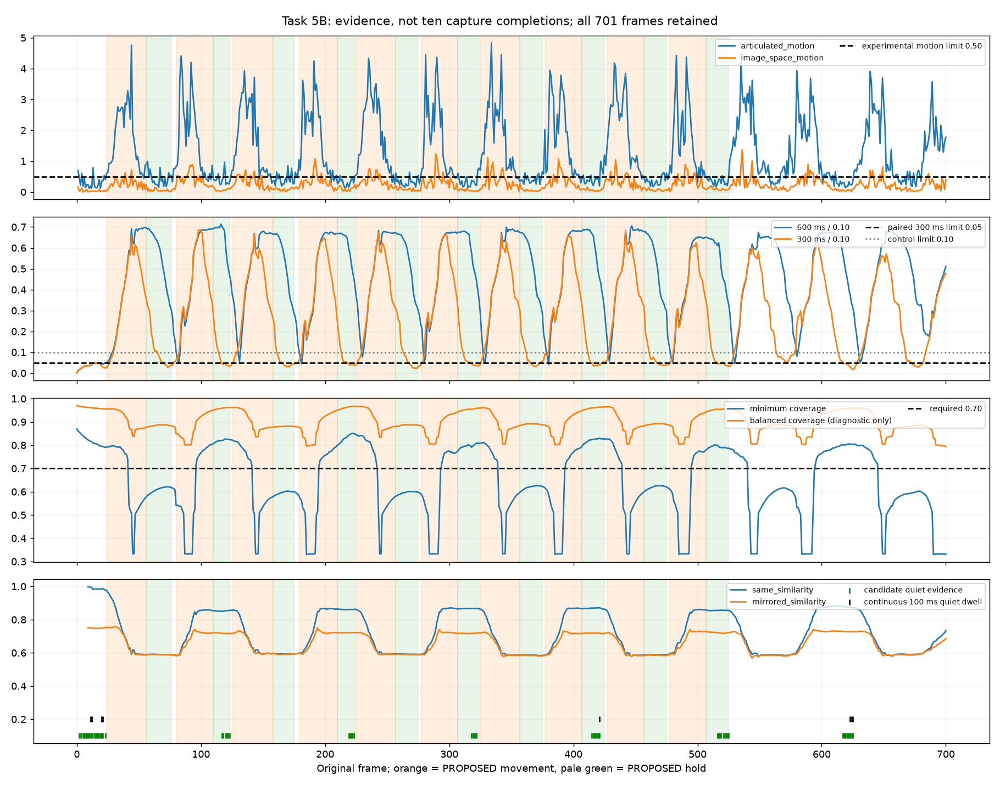

# Task 5B — real baseline, stability and coverage calibration

Status: DONE as an offline experiment; acceptance criteria **partially met**.
No production configuration is approved. Work continues from Task 5 commit
`a0d51db`. The input pair, 701 frames, timestamps, proposed labels, extractor,
segmenter, Temporal Observation Core and mirrored geometry are unchanged.

The best follow-up experiment is **`real-sideview-rate-preserving-v1`**. It forms
a real reference at frame 9, arms at 183 ms and detects the proposed first start
at 400 ms without clipping. It does not complete. This is useful calibration
evidence, not a successful ten-punch capture result.



## 1–4. Real quiet and movement distributions, overlap, and why 0.1 failed

Statistics were calculated **before selecting candidates**. All interval labels
remain `PROPOSED`, with their original approximately ±5-frame uncertainty.
Movement uses `[start,end)`; terminal hold uses `[start,end]`, assigning the shared
boundary to the hold. There are 310 movement frames, 181 terminal-hold frames,
24 opening-hold frames, and 11 unreviewed gap frames through frame 525. Gap frames
are not assumed quiet. Later punches and arm lowering remain in replays but are
not used as ordinary post-roll/stillness. Low-coverage statistics cover the full
701-frame recording and overlap other groups.

Articulated motion, in torso-normalized units per second:

| Interval | Min | Median | p75 | p90 | p95 | Max |
|---|---:|---:|---:|---:|---:|---:|
| Movement | 0.257814 | 1.617303 | 2.742072 | 3.346944 | 3.887448 | 4.834321 |
| Terminal hold | 0.136807 | 0.356997 | 0.467345 | 0.608391 | 0.745248 | 1.198514 |
| Opening hold | 0.115381 | 0.239947 | 0.425584 | 0.594576 | 0.693847 | 0.794775 |

The terminal-hold and movement ranges overlap from 0.258 to 1.199. A single
motion cutoff cannot perfectly separate them. Image-space medians are 0.0684
during terminal holds and 0.3050 during movement; these ranges also overlap.
Not one available articulated observation is below the segmenter's 0.1 quiet
limit. The extractor's independent 0.12 reference limit also fails to collect
three qualifying samples. These are separate failures, not evidence that the
video lacks stable poses.

See [full signal distributions](distributions.md),
[all numerical and regional distributions](distributions.json),
[readable regional tables](regional-distributions.md), and
[empirical distribution plot](motion-distributions.png). Every requested group
and signal has count, min, median, p75, p90, p95 and max. Regional raw and robust
frame-to-frame motion are both included. Numeric articulated estimates with
INSUFFICIENT_COVERAGE status are retained as diagnostics, not upgraded to reliable
whole-body evidence. First-frame regional placeholder zeros are excluded from
pairwise regional statistics.

## 5–7. Extractor qualification, segmenter quiet threshold and dwell

The first candidates were 0.35, 0.50 and 0.65, near the observed hold median,
p75 and p90. A subsequent 0.30 extractor refinement followed a concrete unsafe
reference-source overlap at 0.35. These were explicit one-dimensional experiments,
not an optimization sweep.

The following percentages apply only to both instantaneous motion channels
being below the indicated limit, **before** coverage/displacement gating:

| Limit | Hold frames quiet | Movement frames falsely quiet | Longest false-quiet run wholly inside movement | First full-run reference | Fresh 3-frame reference probes overlapping movement |
|---|---:|---:|---:|---|---:|
| 0.12 extractor control | 0% | 0% | 0 ms | none | 0 |
| 0.30 | 36.46% | 1.29% | isolated frames, 0 ms | frame 9 / 150 ms | 0 |
| 0.35 | 46.41% | 2.26% | isolated frames, 0 ms | frame 9 / 150 ms | 1 |
| 0.50 | 79.01% | 8.39% | 34 ms | frame 7 / 117 ms | 10 |
| 0.65 | 92.82% | 18.71% | 100 ms | frame 4 / 67 ms | 32 |

The original segmenter limit 0.10 also accepts no motion-only hold frames.
All full-run extractor references above form in the opening hold, but that alone
does not establish safe reference qualification. Fresh extractor probes start at
every possible frame with three samples, including inside motion. At 0.35 the
probe at 209–211 incorporates movement frame 209 even though it forms just after
the proposed end. At 0.50 and 0.65, some references form entirely during movement.
These thresholds are rejected for extractor reference building. At 0.30 no
probe's source frames overlap any numbered proposed movement. This is evidence
for this recording, not a universal cold-start guarantee for very slow motion.

Keep the two concepts separate: **0.30** selects cleaner reference samples;
**0.50** permits noisier stability observations only with coverage, displacement,
and sustained dwell. At 0.50, adding current coverage alone reduces quiet hold
acceptance to 38.67% and false quiet movement acceptance to 5.16%. Retaining the
original 600 ms / 0.10 displacement gate still rejects every terminal-hold frame.

Baseline dwell comparisons were 75, 100 and 150 ms. At 0.50, neither motion-only
nor motion-plus-coverage evidence produces false fulfilled dwell during any of
the ten proposed movements at any of these durations. At 100 ms the opening hold
provides four fulfilled frames; 150 ms provides none there. At 0.35, 100 ms does
not fulfill even in the opening hold. At 0.65, false fulfilled dwell extends into
movement even with 150 ms, including evidence that begins before movement onset.
Thus 0.65 is rejected; **100 ms remains unchanged**. Completion dwell and start
dwell also remain 100 ms. A brief quiet candidate is not a completed capture.

[Threshold experiment](threshold-experiment.json) separates motion-only,
motion+coverage, and all-current-gate acceptance. [Dwell results](dwell-experiment.json)
include every false fulfilled frame and an explicit per-punch breakdown.

The quiet limit cannot exceed the start threshold in the existing configuration
contract. Raising start from 0.20 to **0.50** is a documented interaction, not an
unrelated tuning change. The old 0.20 has held-pose false-motion runs up to 300 ms;
0.50 reduces this to 50 ms, below the unchanged 100 ms start dwell. Its first
sustained run starts at proposed frame 24. Alternatives 0.65/0.80 move onset to
26, and 1.0 to 29, clipping more preparation. See
[start-threshold interaction](start-threshold-interaction.json).

## 8. Accumulated displacement and the slow-motion regression

The original 600 ms / 0.10 gate never clears before the next punch for any of
the ten terminal intervals. Stable-onset displacement ranges 0.651–0.695, well
above 0.10. These approximately 0.22–0.33-second holds are shorter than the
600 ms memory. The signal is endpoint displacement over the available rolling
window, not a monotonic decay filter.

The first window experiments retain limit 0.10: 300 ms clears during every hold
after 66–150 ms, and 150 ms clears by every proposed stable onset. However the
150 ms replay also enters false settling seven times inside proposed movement.
More seriously, **both unpaired shortened windows fail a generic slow-motion
challenge**: a burst followed by continuous joint drift until 2,000 ms.

| Window / limit | Synthetic terminal boundary | Decision | Offset from real synthetic end | Verdict |
|---|---:|---:|---:|---|
| 600 ms / 0.10 | 2,250 ms | 2,350 ms | +250 ms | conservative |
| 300 ms / 0.10 | 900 ms | 1,000 ms | −1,100 ms | reject: premature |
| 150 ms / 0.10 | 750 ms | 850 ms | −1,250 ms | reject: premature |
| 300 ms / 0.05 | 2,150 ms | 2,250 ms | +150 ms | retained for follow-up |

The additional paired experiment **300 ms / 0.05** preserves the original
limit/window ratio (approximately 0.167 torso units/s for constant drift).
This is not a proof of equivalence for arbitrary trajectories or partial startup
windows. It does preserve this specific slow-drift safeguard and makes the real
holds eligible for evidence without removing the gate.

| Punch | 600/0.10 crossing before next punch | 300/0.10 delay | 300/0.05 crossing frame / delay |
|---|---|---:|---|
| 1 | none | 150 ms | 70 / 234 ms |
| 2 | none | 84 ms | 117 / 117 ms |
| 3 | none | 67 ms | 164 / 100 ms |
| 4 | none | 67 ms | 219 / 150 ms |
| 5 | none | 117 ms | 267 / 167 ms |
| 6 | none | 83 ms | 318 / 183 ms |
| 7 | none | 83 ms | 366 / 150 ms |
| 8 | none | 84 ms | 414 / 117 ms |
| 9 | none | 66 ms | 468 / 183 ms |
| 10 | none | 83 ms | 516 / 150 ms |

All paired crossings occur within their proposed holds. A crossing alone does
not imply enough remaining dwell or sufficient coverage. The paired full replay
accepts 32/181 terminal-hold frames as quiet (17.68%), up from zero, with zero
false quiet dwell or false settling inside the numbered movements. Only one
terminal-hold frame fulfills a continuous 100 ms quiet monitor; it is not a
completion because the end-pose relationship still fails.

See [per-frame decay data](displacement-experiment.json),
[ten decay plots](displacement-decay.png), and
[synthetic challenge results](slow-challenge-results.json). The synthetic input
is generated from generic geometry, not this recording or punch labels.

## 9–11. Regional coverage, minimum versus balanced, and critical regions

Minimum coverage is below 0.70 on 377/701 frames. Its range is 0.330–0.870;
balanced coverage is 0.793–0.971. Pose detection on all 701 frames does not prove
that the obscured limbs are observed reliably.

| Region | Movement pair-coverage median | Terminal-hold pair-coverage median |
|---|---:|---:|
| Head | 0.9986 | 0.9992 |
| Torso | 0.9968 | 0.9974 |
| Left arm | 0.5901 | 0.6251 |
| Right arm | 0.9951 | 0.9966 |
| Left leg | 0.7338 | 0.7619 |
| Right leg | 0.9687 | 0.9730 |

The source left wrist is below confidence 0.50 in **96/181 held-pose frames** and
148/310 movement frames; the right wrist is never below it in those groups.
The left elbow is below it on 64 movement frames, left knee on 59. This is
consistent with the side-view occlusion seen in the existing video sheets, but
it is also genuine uncertainty in the observed landmarks. Expected occlusion
does not make the missing far wrist trustworthy. There is no independent
tracking ground truth here to separate harmless projection from estimation
error. Full regional distributions and frequencies below 0.50/0.65/0.70/0.75 are
in [distributions.json](distributions.json); per-joint details are in
[landmark-confidence.json](landmark-confidence.json).

The following policies were evaluated offline on the same exported observations;
none was installed into runtime:

1. **Minimum-region ≥0.70:** retained. It protects uncertain limbs but blocks
   right-punch terminal holds in this view.
2. **Balanced ≥0.70:** rejected as a blanket substitute. At 300 ms / 0.10 it
   enables five fulfilled dwell frames despite minimum coverage below 0.70;
   at 150 ms / 0.10 it enables nineteen. No false dwell in these particular
   numbered movements proves neither missing-limb stillness nor slow safety.
3. **Critical torso + right arm ≥0.70, every region ≥0.50:** a diagnostic
   exclusion example only. It behaves like balanced coverage on this clip but
   cannot establish stillness of a left arm or a later kick. Hard-coding this
   side is unacceptable. Requiring torso + both arms instead reproduces the
   conservative restriction here. A future generic external set of required
   regions could be studied only with explicit missing-region UNKNOWN behavior
   and adversarial movement of every omitted limb; no such contract is added
   in Task 5B.
4. **Different positive/terminal evidence requirements:** already supported.
   A strong available motion channel can prove movement even with low coverage;
   terminal stillness requires conservative coverage of the whole configured
   body. Keep this asymmetry.

[Coverage-policy comparison](coverage-policy-experiment.json) includes acceptance,
false dwell and low-minimum-coverage dwell frames for all tested windows/limits.
No karate-specific active-arm knowledge enters runtime.

## 12–14. First real reference, same-pose and mirrored behavior

The 0.30 extractor forms its fixed reference from **frames 7, 8, 9**, at 150 ms.
Their motion values are 0.1448, 0.2399, 0.2376, and coverages are 0.8319, 0.8255,
0.8227. All are in the opening hold. Independent relative-pose RMS differences
between these source samples are only 0.00422–0.00465 torso units. All expected
selected joints are usable. The reference does not update later; changing only
the displacement window gives exactly identical similarity values.

Same-pose similarity is approximately 0.979–0.997 during the remaining opening
hold. Later left-punch holds have medians 0.853–0.868, while right-punch holds
have medians 0.586–0.594: useful separation relative to the fixed initial pose.

Mirrored similarity does **not** behave as a dependable alternating-side
classifier. Right-punch hold medians are only 0.584–0.591, approximately equal
to same-pose scores; left-punch hold medians are 0.717–0.722. The corrected
fixed-axis reflection is deterministic and existing synthetic mirror tests pass,
but real torso yaw, stance, motion asymmetry and occlusion mean these held poses
are not established exact mirror equivalents. Task 4's correction is **not
validated for real alternating-hold recognition** by this recording. No mirrored
geometry or similarity threshold is changed to force a match.

See [reference samples, consistency and per-hold similarity distributions](reference-similarity.json).

## 15–17. Control, named experiments and exact parameter changes

Every full run processes all 701 frames from scratch twice, comparing exact
trace JSON. Arming is requested at timestamp zero without an invented cue or
deadline. Labels are null in every runtime fixture; the CLI rejects labeled
fixtures. Theoretical-impact frames are never read by the experiment runner.
`conservative-v1` frame observations match Task 5 exactly and remain BASELINE /
NOT_ARMED with no reference.

| Run | Extractor reference limit | Quiet / start | Displacement window / limit | Real result | Disposition |
|---|---|---|---|---|---|
| conservative-v1 | 0.12 | 0.10 / 0.20 | 600 / 0.10 | BASELINE | unchanged control |
| noise-calibration-only-v1 | 0.30 | 0.50 / 0.50 | 600 / 0.10 | MOVING; no terminal quiet | causal ablation |
| real-sideview-calibration-v1 | 0.30 | 0.50 / 0.50 | 300 / 0.10 | MOVING | rejected: synthetic early completion |
| short-window-diagnostic-v1 | 0.30 | 0.50 / 0.50 | 150 / 0.10 | MOVING; 7 false settling entries | rejected diagnostic |
| real-sideview-rate-preserving-v1 | 0.30 | 0.50 / 0.50 | 300 / 0.05 | MOVING; no false settling | best follow-up experiment, not production |

For the retained experiment, **only five configuration values differ from
conservative-v1**: extractor reference limit 0.12→0.30; segmenter quiet 0.10→0.50;
start 0.20→0.50; displacement window 600→300 ms; displacement limit 0.10→0.05.
The last pair is a demonstrated interaction. Baseline sample count 3, extractor
coverage 0.75, minimum landmark confidence 0.50, completion coverage 0.70,
baseline/start/settling dwell 100 ms, similarity threshold 0.80, 300 ms
no-movement timeout and all other defaults are unchanged. No per-punch tuning.

Earlier extractor-only 0.35/0.50/0.65 and window-only 300/150 probes are in the
phase manifests. They are not additional recommended configurations. Exact
manifests are [phase 2](phase2-plan.tsv), [phase 4](phase4-plan.tsv),
[candidate/ablation runs](candidate-plan.tsv), and
[paired refinement](rate-preserving-plan.tsv). See
[candidate comparison](candidate-comparison.json) and the retained
[full trace](real-sideview-rate-preserving-v1.trace.json) /
[per-frame evidence audit](real-sideview-rate-preserving-v1.audit.tsv).

## 18–23. Per-punch safety, clipping, early completion and extra footage

The retained full sequence forms a reference at frame 9, arms at 183 ms, and
emits MOVING at 500 ms with estimated boundary **400 ms / frame 24**. Compared
with proposed Punch 1, start offset and extra pre-roll are both **0 ms**.
There are no clipped-start events and no premature completion events. There
are also **no completed real captures**, so this is not a capture-safety pass.

Every right-punch hold (1, 3, 5, 7, 9) fails minimum coverage on every labeled
stable frame. Later left-punch holds have coverage but same-pose similarity
above 0.80, failing the fixture's DIFFERENT_STABLE_POSE relationship to its
initial left hold. The runner cannot complete Punch 1 at a later left hold.
This conservative distinction prevents an unrelated later movement from being
reported as successful first-punch completion.

The complete [ten-row safety table](per-punch-safety.md) and
[machine-readable details](per-punch-safety.json) contain proposed starts/ends,
detected starts, offsets, terminal boundaries, decision times, pre/post-roll,
clipping, false settling, per-frame coverage loss and reference validity.
Missing boundaries and offsets are null, not zero. Punches 2–10 have no new
ARMED→MOVING transition: they occur while the first capture remains unresolved.
Later SETTLING→MOVING transitions are resumes, not independent punch detections.
The fixed reference remains valid as an initial reference, not a per-punch one.

Because the first capture **did not complete safely**, the task's prerequisite
for advancing to independent per-repetition reset runs was not met. The safety
table therefore evaluates the actual shared single-capture run and local
evidence rather than fabricating ten independent capture results. Those reset
diagnostics remain for Task 5C after explicitly reviewing this limitation.

No finalized terminal boundary exists, so completed-clip extra post-roll and end
offsets are unavailable. By EOF there are 10,734 ms of observed data after
proposed Punch 1's end, including the remaining numbered and three additional
punches. That is an unresolved observation span, not 10,734 ms of stationary
post-roll or an actual saved clip. No recorder is involved.

**Zero premature completion is met on this real replay, conservatively, with
zero completions.** The paired candidate also meets it on the synthetic slow
challenge; the unpaired 300/150 ms configurations fail and are rejected. The
retained candidate has zero intermediate false settling and zero false fulfilled
quiet dwell inside all ten proposed movement intervals. These findings do not
establish safety for unreviewed gaps, arbitrary slow movement, or another camera
view. Raw scorer FALSE_POSITIVE on an emitted unlabeled start is not treated as
reviewed truth; comparisons here are explicit external PROPOSED-label audits.

## 24–26. Tests, changed files and remaining uncertainty

- All **344 Python tests passed** (`python -m pytest -q`).
- All **155 core JVM tests passed**, including six new general calibration safety
  tests: bounded noisy baseline, insufficient-coverage baseline, brief quiet
  plateau, slow/missing displacement, uncertain-limb completion, and an actual
  extractor+segmenter drift challenge comparing paired versus unpaired windows.
- Hand adapter: 23 tests passed in each debug/release variant. Pose adapter:
  3 tests passed in each variant.
- Full Gradle `test --continue` ran app debug and release tests: **185/187 pass
  in each variant**. Existing `LearningArtworkArchitectureTest` line 51 and
  `SettingsScreenArchitectureTest` line 26 fail on their source-string assertions.
  App sources/tests are unchanged from the Task 5 baseline; these failures were
  not weakened or fixed as part of calibration. [Exact test names/results](kotlin-test-results.json).
- Full replay outputs are deterministic; original control observations match
  Task 5 exactly. Plots were rendered and visually inspected. No device or live
  capture testing is claimed.

Changed files are the test-only `MotionCalibrationCli.kt`,
`MotionCalibrationSafetyTest.kt`, core Gradle development task,
`scripts/experiments/task5b_calibration.py`, this calibration artifact directory,
and documentation links. All production source and production defaults remain
unchanged. Large derived sweep traces and Gradle logs stay under ignored
`output/task5/calibration/`; the one retained real trace and compact evidence
artifacts follow Task 5's existing tracked-artifact convention.

The remaining uncertainties are material: one side-view recording; PROPOSED
boundaries; no independent far-side landmark truth; no successfully completed
first capture; mirror scores that do not validate alternating holds; limited
quiet dwell remaining after displacement clears; fixed-reference relationship
semantics across repeated movements; and no universal cold-start/very-slow-motion
guarantee from a sample-count reference builder. Keeping the limit/window ratio
preserves a constant-drift scale, not arbitrary trajectory safety. The first
frame has no measured velocity and rolling history initially has less than a
full window. These constraints must be challenged before production use.

## 27. Exact recommendation for Task 5C

Run the full real-sequence safety rerun with **frozen
`real-sideview-rate-preserving-v1`**, alongside unchanged conservative-v1. Review
the proposed movement/hold boundaries and the first capture's unresolved
coverage/reference-relationship outcome before claiming success or adding a
reset protocol. Then, as explicitly labeled offline diagnostics, evaluate
bounded per-repetition windows with one common configuration and fresh state;
never infer continuous repetition-control behavior from them. Keep missing
far-side evidence UNKNOWN. Include synthetic slow drift, camera motion,
occlusion, temporary plateaus and startup-during-motion challenges. Obtain at
least one additional real recording with a clear initial hold and a different
view/pace, preferably including a deliberately slow movement, before considering
live integration. Assess mirrored-pose equivalence separately from side
alternation. Do not replace minimum coverage or change geometry merely to improve
the completion count. **Do not begin CameraX on the strength of baseline arming.**

## Reproduction

Use the Task 5 importer/preparation command if the ignored real fixture is absent.
From repository root in PowerShell, with Python dependencies installed:

```powershell
python scripts/experiments/task5b_calibration.py distributions
$task5bRoot = (Get-Location).Path
$env:JAVA_HOME = 'C:/Program Files/Android/Android Studio/jbr'
foreach ($task5bPlan in @('phase2-plan','phase4-plan','candidate-plan','rate-preserving-plan')) {
  & ./android/KarateClipRecorder/gradlew.bat -p android/KarateClipRecorder :karate-analyzer-core:calibrateMotion "-PreplayInput=$task5bRoot/output/task5/real-kihon-10-punch.fixture.json" "-PcalibrationPlan=$task5bRoot/docs/validation/task5/calibration/$task5bPlan.tsv" "-PreplayOutput=$task5bRoot/output/task5/calibration"
  if ($LASTEXITCODE -ne 0) { throw 'Calibration replay failed' }
}
python scripts/experiments/task5b_calibration.py slow-challenge
foreach ($task5bPlan in @('candidate-plan','rate-preserving-plan')) {
  & ./android/KarateClipRecorder/gradlew.bat -p android/KarateClipRecorder :karate-analyzer-core:calibrateMotion "-PreplayInput=$task5bRoot/output/task5/calibration/slow-challenge.fixture.json" "-PcalibrationPlan=$task5bRoot/docs/validation/task5/calibration/$task5bPlan.tsv" "-PreplayOutput=$task5bRoot/output/task5/calibration/slow-challenge"
  if ($LASTEXITCODE -ne 0) { throw 'Synthetic replay failed' }
}
foreach ($task5bPhase in @('thresholds','displacement','candidates','reference','tables','plots')) {
  python scripts/experiments/task5b_calibration.py $task5bPhase
}
python -m pytest -q
& ./android/KarateClipRecorder/gradlew.bat -p android/KarateClipRecorder test --continue
```

The manifests preserve the sequential choices made during the experiment;
running them together reproduces the finished evidence, not a blind search.
`tables` summarizes existing Gradle XML reports, so rerun it after tests when
refreshing the archived test results.
