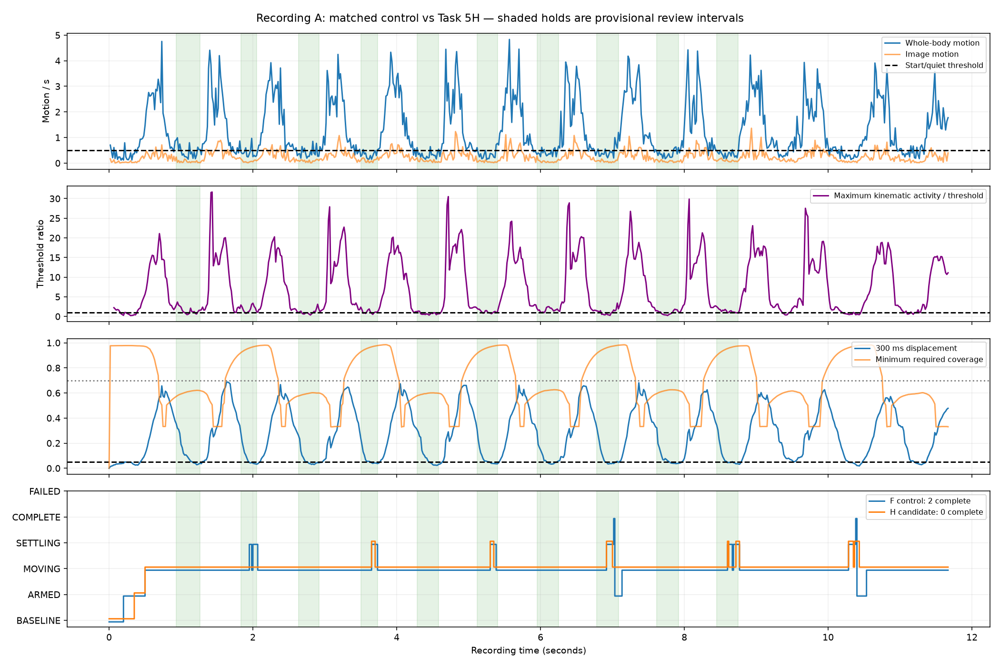
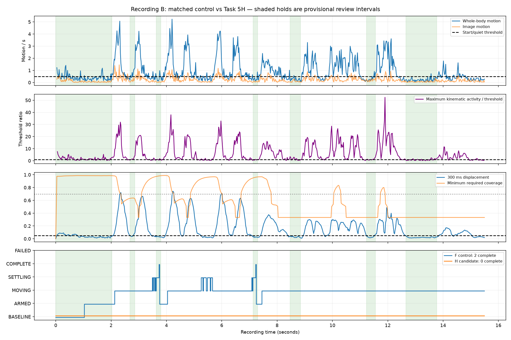

# Task 5H — filtered kinematics validation

Local validation of the resumed candidate. Production acceptance: **REJECTED**.

## 1. Outcome and scope

**Reject default activation of this candidate.** The core decision path and offline diagnostics are implemented, but the requested production acceptance is not achieved. GenericMotionSegmenter defaults kinematic gating off; explicit H replays enable it. No CameraX, Android UI, deployment, or threshold search was performed.

## 2. Configuration provenance

Task 5G's JSON evaluates a 0.35 torso/s wrist activity threshold; its report recommends the same. Task 5H uses the user's corrected 0.35 endpoint, 0.25 radial, 35 degree/s joint/orientation, and 18 degree/s yaw thresholds. The 5G evaluated angular activity threshold was 30 degree/s. These are candidate values, not independently validated universal thresholds.

## 3. Filter identity

The resumed implementation uses endpoint-pair averages divided by their **midpoint timestamp separation**, multiplied by directional coherence. This resembles Task 5G's sixth hybrid method, not its recommended fifth method (confidence-weighted regression slope × coherence). Its denominator also differs from dividing by the complete window span. The 5G winning-method claims therefore do not establish acceptance of this implementation. A faithful Method 5 port remains a separate unresolved implementation item; this report does not silently equate the two.

## 4. Causal window

Only samples in [t−100 ms,t] contribute. At least three samples, at least 60 ms span, current-sample presence, finite geometry and confidence ≥0.50 are required. Confidence is checked for each channel's actual landmarks. A missing elbow cannot hide trustworthy endpoint translation. Scalar, unit-vector orientation, circular yaw, and hip-centered torso-normalized endpoint/radial channels are supported.

## 5. Strict ternary evidence

Any evaluable production channel at or above its threshold yields TRUE. FALSE requires every production channel in that aggregate to be evaluable and below threshold; partial absence or degenerate geometry otherwise yields UNKNOWN. Pelvis 3D is diagnostic-only and excluded from that aggregate by default. Regression tests cover missing elbows, degenerate limbs, invalid confidence, and stale windows.

## 6. Positive-only integration

Kinematic TRUE can start movement and veto baseline/terminal stillness. FALSE and UNKNOWN never prove quiet: whole-body motion, displacement, coverage and the configured pose relationship remain authoritative. Required coverage regions do not mask movement in a visible optional limb.

## 7. Baseline readiness and short bursts

Arming again requires a confirmed quiet baseline. The interrupted implementation bypassed the kinematic veto during baseline; that bypass was removed. Short bursts can fail to satisfy movement dwell yet still interrupt a quiet dwell. The prior claim that all such noise is 'absorbed' by 100 ms dwell is incorrect.

## 8. Causality and measured latency

Prefix causality tests pass. Synthetic tests isolate kinematics by keeping whole-body channels below threshold. Crossing latency excludes the 100 ms movement dwell. The slow case fails the requested <80 ms gate; fast translation passes. No W/2 assumption is used.

| Speed (torso/s) | FPS | Threshold crossing delay | Boundary error |
|---:|---:|---:|---:|
| 0.4 | 60 | 83 ms | 0 ms |
| 0.4 | 49 | 82 ms | 0 ms |
| 0.4 | 30 | 100 ms | 0 ms |
| 1.0 | 60 | 50 ms | 0 ms |
| 1.0 | 49 | 41 ms | 0 ms |
| 1.0 | 30 | 67 ms | 0 ms |

## 9. Boundary recovery

After a filtered channel is confirmed, a contiguous trustworthy raw precursor within the causal window can select the earlier start. The prior sample is the left edge of a frame-to-frame raw-motion interval. Selection cannot cross arm/rearm. All six controlled onset cases recover within ±25 ms; this is not proof of real-video boundary accuracy.

## 10. Slow and plateau behavior

A geometrically verified 140-degree locked elbow translates at 0.40 torso/s and triggers via translation without joint rotation. Both travel directions for wrists, knees and ankles are tested, plus slow joint and pelvis rotation. Slow near-threshold motion incurs 82–100 ms crossing delay. Physical pauses still need the independent displacement and stable-dwell criteria; a low angular rate alone cannot complete a segment.

## 11. Adversarial coverage

The suite covers at least 13 adverse/lifecycle cases: static jitter; alternating jitter; isolated high-confidence spike; low-confidence wrist spike; low-confidence knee spike; missing wrist; missing elbow; degenerate limb; NaN confidence; stale sample window; camera translation; seamless rearm; full reset. These are deterministic synthetic checks, not certification against every occlusion, camera zoom, or real noise pattern. Real holds fail despite the synthetic checks.

## 12. Frame-rate behavior

Tests use rounded timestamp grids at actual 60, 49 and 30 fps. Steady translational rates remain approximately correct, but threshold latency is not invariant. See the timing table; 30 fps slow motion needs the full 100 ms window. Frame-rate equivalence is not claimed.

## 13. Seamless rearm

Confirmed terminal samples are preserved, so the next frame can have evaluable filtered kinematics without warm-up. Explicit reset clears history. Rearm now records COMPLETE→ARMED and clears prior-segment transition records; otherwise subsequent segments incorrectly reused the first movement's boundaries. This bookkeeping correction is shared by the matched F and H runs.

## 14. Compound movements

Evidence-level tests show an 80 ms quiet gap does not complete and a 120 ms gap can complete/rearm with distinct later boundaries. The older test labelled 150 ms remains as an additional check. These are evidence-level tests: a physical 120 ms pause need not produce a 120 ms quiet-evidence interval after smoothing and the 300 ms displacement window. That stronger end-to-end claim is not established.

## 15. Recording A provenance and replay

All 701 fixture frames and timestamps are replayed in order. Fixtures are label-free; their SHA256 hashes are in task5h-comparison.json. Existing importer preservation tests remain passing. The complete sequence, not selected punch windows, is fed to Kotlin.

| Recording | Control completions | H completions | H hold-positive frames | Longest H hold-positive burst |
|---|---:|---:|---:|---:|
| A | 2 | 0 | 100/171 | 183 ms |
| B | 2 | 0 | 104/216 | 224 ms |

## 16. Causal four-way ablation

On controlled geometry with whole-body channels below threshold, existing-only, angular-only, translation-only and both yield [false,false,true,true] for locked-joint translation and [false,true,false,true] for isolated angular movement. Ablation filters the channels supplied to the same segmenter; it does not use review labels or future data.

## 17. Recording A boundaries and clipping

All ten prior movement/terminal proposals remain provisional in ../proposed-labels.json. The JSON associates each proposal with overlapping emitted segments and reports signed start/end error where defined; a single long segment overlapping several punches is not ten detections. H emits one incomplete movement and no terminal completions, so individual H punch boundaries are unavailable. An incomplete EOF segment represents missing completion, not a successful punch window.

## 18. Punch 1 and extra recording content

The prior review identifies the initial held pose as left-censored, while numbered Punch 1 begins visibly and is not left-censored. No impact frame was used to determine segmentation. Frames outside the ten proposal intervals, including later movements and final arm lowering, remain in the replay. This run does not re-adjudicate the earlier video review.

## 19. Recording B comparison

The complete 763-frame blind sequence is replayed. The matched F control completes 2 movements, then remains incomplete. H stays BASELINE for all frames and never arms. Review intervals come from Task 5G and are evaluation-only, not independently adjudicated ground truth. The control matches Task 5F's side-neutral configuration, not its weakened right-arm-only coverage ablation.

## 20. Coverage and abstentions

Quiet evidence is UNKNOWN on 384 A frames and 457 B frames. Coverage is unchanged between matched runs. Occluded required regions continue to block proof of quiet. H adds false-positive vetoes; weakening coverage or suppressing optional-limb motion to restore counts would conceal the failure.

## 21. Hold noise and premature completion

H is positive on 100/171 reviewed A hold frames and 104/216 B hold frames. The longest sample-supported runs are 183 and 224 ms. H has no premature completed segments because it has no completed segments; that does not make it successful. Hold review intervals are provisional and rates include their boundary ambiguity.

## 22. Camera-scale behavior

World torso scale and image scale distributions are exported in the comparison; per-frame scales and scale changes are in the trigger trace. The synthetic camera-translation check passes. Real data do not isolate camera zoom from anatomical/tracker changes, so scale invariance cannot be inferred. Hip-centered normalized translation can still reflect scale-estimation noise.

## 23. Mirrored similarity

Same and mirrored similarities remain available in the trace. ANY_STABLE_POSE_AFTER_MOVEMENT accepts a stable pose regardless of those similarities. No mirrored-similarity threshold was tuned and no mirrored-pose requirement is used to force the ten-punch count.

## 24. Decision diagnostics

Each channel includes raw rate, smoothed rate, coherence, activity, threshold, confidence, evidence and whether it participates in gating. Activity = abs(smoothed rate) × coherence, so smoothed rate alone must not be compared to the gate. The altered-evidence-or-dwell flag includes withheld readiness/settling; it is not a count of extra emitted state transitions.

## 25. Corrections from the interrupted session

Restored baseline prerequisite/veto; removed required-region masking of positive optional-limb evidence; corrected unavailable-channel ternary aggregation and pelvis 3D threshold; honored configured history size; validated smoother timestamps, finite inputs and current-sample presence; repaired rearm transition lifetime; added raw-supported start selection and auditable channel diagnostics. The two tests previously arming before extraction established a full quiet dwell now seed a preceding static sample.

## 26. Validation evidence

Core JDK 17 result: 217 tests, 0 failures, 0 errors, 0 skipped. Python suite: 344 passed in the local run. The slow-latency characterization asserts eventual crossing within the window; the stricter requested <80 ms release gate is separately recorded as FAILED, not redefined as passing. No native app/device build is claimed.

## 27. Reproduction

Set JAVA_HOME to JDK 17; run `./gradlew.bat :karate-analyzer-core:test --rerun-tasks` from android/KarateClipRecorder, then `python scripts/experiments/task5h_filtered_kinematics.py` from the repository root. The script requires the existing A/B pose fixtures and asserts frame counts, label absence, timestamp order and replay preservation. `--reuse` regenerates artifacts from saved traces. Gradle jobs must run sequentially in this shared checkout; an initial concurrent attempt collided on Kotlin's build cache and was rerun sequentially.

## 28. Acceptance and remaining work

**Production activation remains rejected.** Required follow-up is a faithful evaluation of the nominated Task 5G Method 5, resolution of hold-noise/readiness and slow-latency failures, and physical-gap end-to-end acceptance. No threshold was adjusted to manufacture a pass. The original numbered 28-question checklist was not present in the supplied plan; these 28 topics cover the available plan and corrections without claiming exact unseen question wording.

