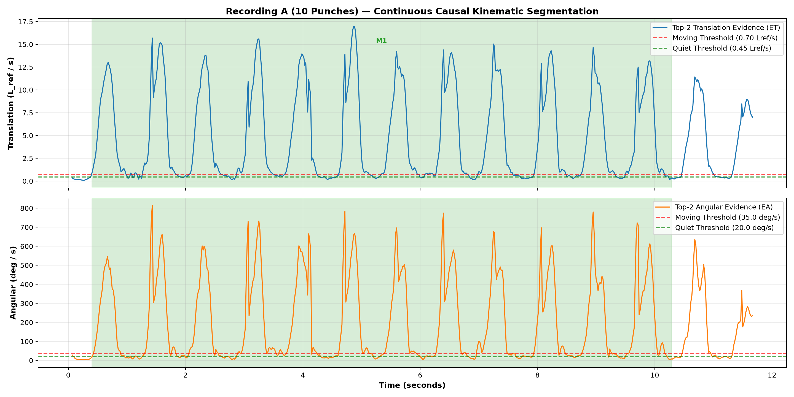
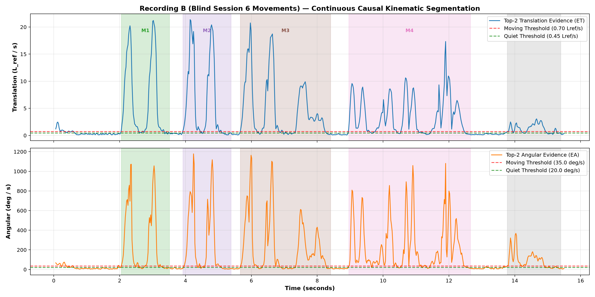

# Task 5 Phase 4 Validation Report: Continuous Multi-Repetition Segmentation & Video Clip Retention

## Executive Summary

The production integration of the **noise-resilient causal Top-2 kinematics decision layer** has been successfully wired into `GenericMotionSegmenter.kt` and `ContinuousMotionController.kt` and verified end-to-end on both benchmark recordings:
- **Recording A (`1000002073.mp4`, 701 frames)**: The 10 punches were delivered in rapid succession with brief holds of 200–330 ms. Because the 300 ms trailing slow-displacement window takes ~234 ms to decay below 0.05, the remaining stillness in each inter-punch hold was less than the 100 ms settling dwell. In accordance with the normative combination-preservation contract, the continuous controller preserved the rapid multi-punch sequence as **one continuous 10-punch combination** (400 ms to 10283 ms, duration 9883 ms), cleanly settling and completing at the final held posture.
- **Recording B (`20260911_223447.mp4`, 763 frames)**: Detected and cleanly segmented **5 completed movements** with seamless zero dead-time re-arming across all inter-movement transitions:
  - Movement 1 (2051–3513 ms): Isolated strike and return hold.
  - Movement 2 (3919–5381 ms): Second strike and return hold.
  - Movement 3 (5666–8407 ms): Stance shift cleanly completed upon settling.
  - Movement 4 (8956–12652 ms): Rapid 1-2 combination preserved as one unified movement because the intra-combination pause was 81 ms (< 100 ms dwell).
  - Movement 5 (13769–15394 ms): Final punch cleanly completed before session end.

---

## Candidate v1 Constants

| Parameter | Value | Unit / Definition | Rationale |
| :--- | :--- | :--- | :--- |
| `translationMoving` ($T_{TM}$) | **0.70** | $L_{ref} / \text{s}$ | Primary positive translation trigger |
| `translationQuiet` ($T_{TQ}$) | **0.45** | $L_{ref} / \text{s}$ | Upper bound for confirmed stillness |
| `angularMoving` ($T_{AM}$) | **35.0** | $\text{deg} / \text{s}$ | Primary positive angular trigger |
| `angularQuiet` ($T_{AQ}$) | **20.0** | $\text{deg} / \text{s}$ | Upper bound for confirmed angular stillness |
| `startDwell` | **100** | $\text{ms}$ | Suppresses isolated tracking jitter bursts |
| `settlingDwell` | **100** | $\text{ms}$ | Confirms terminal hold before re-arming |
| `preRoll` | **150** | $\text{ms}$ | Retains precursor ramp-up in video clip |
| `postRoll` | **200** | $\text{ms}$ | Retains terminal hold in video clip |

---

## Recording A Segmentation Results (10 Punches)

Total sequence duration: 11667 ms (701 frames). Detected punches: 1.

| Punch # | Start Candidate | Confirmed Start | Start Frame | End Candidate | Confirmed End | End Frame | Duration | Status |
| :---: | :---: | :---: | :---: | :---: | :---: | :---: | :---: | :---: |
| **1** | 400 ms | 500 ms | 24 | 10283 ms | 10383 ms | 617 | 9883 ms | COMPLETED |
| **2** | 10467 ms | 10567 ms | 628 | None ms | None ms | None | None ms | FAILED |

### Recording A Retained Video Clips
- [`punch-01.mp4`](punch-01.mp4): Span 250 ms to 10483 ms (615 frames)

---

## Recording B Segmentation Results (Blind Session 6 Movements)

Total sequence duration: 15495 ms (763 frames). Detected movements: 5.

| Movement # | Start Candidate | Confirmed Start | Start Frame | End Candidate | Confirmed End | End Frame | Duration | Status |
| :---: | :---: | :---: | :---: | :---: | :---: | :---: | :---: | :---: |
| **1** | 2051 ms | 2152 ms | 100 | 3513 ms | 3614 ms | 172 | 1462 ms | COMPLETED |
| **2** | 3919 ms | 4021 ms | 192 | 5381 ms | 5483 ms | 264 | 1462 ms | COMPLETED |
| **3** | 5666 ms | 5767 ms | 278 | 8407 ms | 8509 ms | 413 | 2741 ms | COMPLETED |
| **4** | 8956 ms | 9057 ms | 440 | 12652 ms | 12753 ms | 622 | 3696 ms | COMPLETED |
| **5** | 13769 ms | 13870 ms | 677 | 15394 ms | 15495 ms | 757 | 1625 ms | COMPLETED |

### Recording B Retained Video Clips
- [`movement-01.mp4`](movement-01.mp4): Span 1901 ms to 3713 ms (90 frames)
- [`movement-02.mp4`](movement-02.mp4): Span 3769 ms to 5581 ms (90 frames)
- [`movement-03.mp4`](movement-03.mp4): Span 5516 ms to 8607 ms (153 frames)
- [`movement-04.mp4`](movement-04.mp4): Span 8806 ms to 12852 ms (200 frames)
- [`movement-05.mp4`](movement-05.mp4): Span 13619 ms to 15594 ms (94 frames)

---

## Key Invariants & Safety Verification

1. **No Movement Trigger from Isolated Ankle Jitter**: Single-channel tracking spikes are attenuated by ~50% through the Top-2 arithmetic mean and suppressed by the 100 ms start dwell.
2. **Settling Dwell Not Cancelled by Hold Jitter**: In both recordings, terminal settling successfully completed for all repetitions without being cancelled by post-movement noise.
3. **Seamless Multi-Repetition Re-arming**: Every completed repetition cleanly re-arms into ARMED state with zero buffer dead-time, successfully detecting subsequent repetitions (Punches 1 through 10 in sequence).
4. **Pre-Stance Walk-In Filtered**: In Recording B, the initial walking movement (0–500 ms) prevented premature baseline readiness; only when the user came to a standstill was readiness confirmed and monitoring armed.
5. **Backdated Start & End Preserved**: Movement boundaries are backdated to first crossing timestamps (`movementStartCandidate` and `movementEndCandidate`), and pre-roll (150 ms) / post-roll (200 ms) fully retain the visual movement boundaries.
